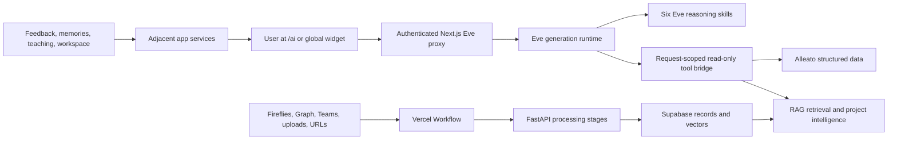

# AI Assistant Functionality and Ownership

**Read this first.** This is the current, human-readable source of truth for
what the Alleato AI Assistant does, which runtime owns each function, what is
actually available through Eve, and what remains incomplete or legacy.

**Last audited:** 2026-07-30

**Assistant route:** `/ai`

**Assistant identity:** Eve

**Generation runtime:** `agents/alleato-assistant/**`

For the capability-by-capability explanation of every assistant surface,
read tool, blocked action, adjacent AI feature, and separate runtime, continue
with `docs/architecture/AI-ASSISTANT-FUNCTIONALITY-CATALOG.md`. This document
is the ownership/status summary; the catalog is the exhaustive functional
reference.

## Status legend

| Status | Meaning |
| --- | --- |
| **Available** | Implemented and exposed through the authenticated Eve path. |
| **Available, source freshness degraded** | The repository function works against stored data, but one or more production source synchronizers are stale. |
| **Adjacent feature** | Implemented in the app, but not executed by the Eve chat runtime. |
| **Built, not exposed to Eve** | Executable code exists, but Eve's production tool bridge intentionally excludes it. |
| **Partial** | Some pieces exist, but the complete user workflow is not production-ready. |
| **Legacy/retired** | Historical implementation; it is not a current owner and must not be restored. |
| **Production proof pending** | The code contract is present, but that specific source or mutation path has not yet received a fresh production trace. |

## Repository versus production deployment

The assistant and RAG ownership model is now published in the canonical
production repository as well as documented here.

| Location | Current state on 2026-07-30 |
| --- | --- |
| This backup repository | Eve, `/ai`, the authenticated proxy/tool bridge, Vercel Workflow, and FastAPI stage adapters are documented and guarded. |
| Canonical production repository, `The-Alleato-Group/project-management` | Eve/Workflow cutover and server/client boundary fixes are published on `main`. |
| Live Render backend | Gateway-configured and serving authenticated stage routes. Source operations are degraded with five actionable health alerts. |
| Canonical Vercel production application | Deployment `dpl_kF3Cp1hELMMzet6r8cuuzbR8LKyb` is `READY`; Workflow production run `wrun_01KYR3MKXQEHC80QFCB56TSD5F` completed all five stages. |

## Current verdict

- Eve is the sole AI Assistant generation runtime in the repository.
- In this repository, `/ai` and the global AI widget use the authenticated Eve
  proxy.
- Eve can answer questions, use six specialist reasoning skills, search
  authorized project/company data, retrieve RAG evidence, and return citations.
- Eve's production tool bridge is **read-only**. It exposes 79 read tools from
  the 131-tool canonical registry. Writes and external delivery are not
  currently available through Eve.
- Conversation history, user memories, feedback, teaching intake, workspace
  artifacts, voice transcription, avatar sessions, and marketing records exist
  as app services. Their relationship to Eve is described below.
- The common workflow and scoped retrieval are healthy. Source operations are
  degraded: 57 SharePoint folders await initial inventory, 2,036 sampled
  documents lack chunks, one Graph subscription is outside the configured
  target set, and 282 searchable SharePoint documents lack project-Documents
  promotion.
- Acumatica historical AR payment applications remain externally blocked until
  the provider exposes the required GI/endpoint.
- The provider path is healthy through Vercel AI Gateway. Direct OpenAI is only
  a fallback and is not the primary production path.
- The authenticated Eve lifecycle and the five-stage RAG workflow are working
  in production. A controlled URL record produced five embedded chunks and a
  project-scoped similarity-`1.0` retrieval result with citation metadata.

## Who owns what



| Responsibility | Owner | Canonical implementation |
| --- | --- | --- |
| AI answer generation and streaming | Eve | `agents/alleato-assistant/**` |
| App-to-Eve authentication and durable turn binding | Next.js Eve proxy | `frontend/src/app/api/ai-assistant/eve/proxy/[...path]/**` |
| Tool discovery and execution | Authenticated, request-scoped Eve tool bridge | `frontend/src/app/api/ai-assistant/eve/tools/route.ts` |
| Canonical tool definitions and policy | Next.js AI runtime | `frontend/src/lib/ai/eve-runtime/production-tool-registry.ts` |
| Source acquisition | Each source adapter | Fireflies, Microsoft Graph, Teams, uploads, URL/import services |
| Durable processing order and retry | Vercel Workflow | `frontend/src/lib/rag-pipeline/process-document-workflow.ts` |
| Parse, vision, embed, and extraction logic | FastAPI | `backend/src/api/main.py` and `backend/src/services/pipeline/**` |
| Operational records and vectors | Supabase | PM database, RAG database, and Supabase Storage |
| Project-intelligence compilation | Backend intelligence services and scheduled jobs | `backend/src/services/project_intelligence/**`, `backend/src/services/intelligence/**` |
| Retrieval authorization and post-filtering | Next.js tool/retrieval layer | `frontend/src/lib/ai/tools/guardrails.ts`, `frontend/src/lib/ai/tools/read/rag-search-tools.ts` |
| Provider routing | Shared AI transport | Vercel AI Gateway first; direct OpenAI fallback |

Eve does **not** own ingestion, parsing, OCR, embeddings, extraction, source
scheduling, packet compilation, or storage. Eve consumes those systems.

## User-facing assistant surfaces

| Functionality | What the user can do | Current status | Owner |
| --- | --- | --- | --- |
| Full-page assistant | Ask questions and receive streamed answers at `/ai`. | **Available** | `RagChatPage` + Eve proxy |
| Global assistant widget | Ask from elsewhere in the application without leaving the current page. | **Available** | `GlobalAiWidget` + same Eve transport |
| Project-scoped chat | Bind a turn to one verified project. User text cannot override the authenticated project ID. | **Available** | Eve auth + tool bridge |
| Company/portfolio chat | Use only tools that are safe without a selected project. | **Available** | Request-scoped catalog |
| Conversation history | Create, list, rename, delete, and reload chat sessions and messages. | **Available** | conversation/message API routes |
| Streaming and stop | Stream Eve's answer and stop the connected request. Durable out-of-band cancellation is not supported by Eve 0.22.6. | **Partial** | Eve hook + durable turn API |
| Citations | Show source-linked evidence returned with assistant messages. | **Available, source freshness degraded** | retrieval tools + citation UI |
| Tool trace display | Show tool progress/results and developer-oriented trace information when present. | **Available** | chat renderer |
| Approval controls | Render approve/reject controls for approval-bearing tool parts. Eve cannot currently receive write/delivery tools, so this is not an active Eve mutation path. | **Built, not exposed to Eve** | chat renderer + tool policy |
| Generative UI widgets | Render typed assistant widgets returned in message parts. | **Available when returned by current Eve output** | assistant widget renderer |
| Voice input | Record speech and transcribe it into the composer. | **Adjacent feature** | speech API + chat UI |
| Spoken response | Use browser speech output controls for assistant text. | **Adjacent feature** | chat UI/browser speech |
| Video avatar | Create a Tavus avatar conversation from `/ai-avatar`. | **Adjacent feature; provider configuration required** | avatar API |
| Cross-source timeline | Aggregate meetings, email, Teams, and documents. The component exists, but the timeline is currently hidden from the chat UI. | **Adjacent feature** | timeline API |

## Eve's six reasoning skills

Skills change how Eve analyzes evidence. They do not grant permissions, ingest
data, or create a separate agent.

| Skill | When Eve uses it | What it produces |
| --- | --- | --- |
| Financial analysis | Budgets, costs, margin, cash, contracts, commitments, change orders, invoices, forecasts, AP, or AR | A source-backed financial headline, supporting figures, gaps, and prioritized actions |
| Operations review | Schedule, milestones, RFIs, submittals, procurement, field progress, blockers, or accountability | The operating constraint, evidence by workflow, dependencies, and unblock actions |
| Risk review | Financial, contract, schedule, procurement, claim, compliance, dispute, change, or portfolio risk | Ranked risks with evidence, impact, controls, triggers, mitigation, owner, and review point |
| People and capacity | Staffing, workload, accountability, roles, transitions, subcontractor relationships, or lessons learned | Evidence-bounded capacity/ownership analysis without unsupported personnel judgments |
| Business development | Pursuits, pipeline, clients, positioning, proposals, competitive context, or past performance | Commercial implications, supported opportunities/risks, gaps, and next pursuit action |
| Marketing strategy | Positioning, campaigns, content calendars, social content, case studies, newsletters, or announcements | Source-backed draft strategy and content recommendations; never automatic publication |

Canonical skill files:

```text
agents/alleato-assistant/agent/skills/
├── business-development.md
├── financial-analysis.md
├── marketing-strategy.md
├── operations-review.md
├── people-capacity.md
└── risk-review.md
```

## Available Eve data and retrieval functions

The following functions are in Eve's current read-only catalog. Project-scoped
tools are omitted automatically until the authenticated turn has a verified
project.

### Project, portfolio, and operating context

| Tool | What it does |
| --- | --- |
| `findProject` | Resolves a project before project-scoped analysis. |
| `getProjectDetails` | Reads the selected project's core record and identifying context. |
| `getProjectBriefingSnapshot` | Returns a compact, current project briefing assembled from approved records. |
| `getPortfolioOverview` | Summarizes the accessible project portfolio. |
| `getProjectsWithRisks` | Finds accessible projects with recorded risk indicators. |
| `getProjectRiskAnalysis` | Reads source-backed risk analysis for one project. |
| `getActionItemsAndInsights` | Returns current actions and intelligence signals for the project. |
| `getImplementationStatus` | Reports the implementation/status record for supported app capabilities. |
| `getCrossProjectComparison` | Compares supported metrics across accessible projects. |
| `getHistoricalTrends` | Reads historical operating trends from structured records. |
| `getSopBacklog` | Reads the supported standard-operating-procedure backlog. |

### Financial and commercial data

| Tool | What it does |
| --- | --- |
| `getCommitmentsOverview` | Summarizes project commitments. |
| `getChangeOrderDetails` | Reads change-order details and status. |
| `getDirectCostsSummary` | Summarizes direct costs. |
| `getBudgetLineItems` | Reads project budget line items. |
| `getCostTrends` | Returns cost movement over time. |
| `getMarginAnalysis` | Calculates supported margin analysis from structured data. |
| `getAPAgingReport` | Reads accounts-payable aging. |
| `getARAgingReport` | Reads accounts-receivable aging. |
| `getCashPositionReport` | Reads supported cash-position data. |
| `getVendorSpendReport` | Summarizes spend by vendor. |
| `getRecentBills` | Reads recent bills. |
| `getRecentInvoices` | Reads recent invoices. |
| `getAcumaticaProjectBudget` | Reads project budget information from the Acumatica integration. |
| `getAcumaticaProjectList` | Lists projects available through Acumatica. |
| `getPurchaseOrderSummary` | Summarizes purchase orders. |
| `getVendorPerformance` | Reads supported vendor performance indicators. |
| `queryBudgetData` | Performs a constrained query over budget records. |
| `queryChangeOrders` | Performs a constrained query over change-order records. |
| `queryCommitments` | Performs a constrained query over commitment records. |
| `queryDirectCosts` | Performs a constrained query over direct-cost records. |
| `searchStructuredFinancialRows` | Searches structured financial rows instead of relying on narrative RAG text. |
| `getForecastComparison` | Compares supported forecast values. |
| `getFinanceSpendRollup` | Reads a portfolio/company spend rollup. |
| `getFinancialAnalysis` | Returns a structured financial analysis result. |
| `getProjectBudgetSummary` | Returns the selected project's budget summary. |

### Schedule, RFIs, submittals, and people

| Tool | What it does |
| --- | --- |
| `getPeopleAndRoles` | Reads project people and role assignments. |
| `getRFIStatus` | Reads RFI status and counts. |
| `getSubmittalStatus` | Reads submittal status and counts. |
| `queryScheduleTasks` | Performs a constrained query over schedule tasks. |
| `getScheduleAnalysis` | Returns structured schedule analysis. |
| `getSubmittalLog` | Reads the project submittal log. |
| `getSpecRequirements` | Retrieves specification requirements relevant to a review. |
| `detectMissingSubmittals` | Compares supported source data to identify likely missing submittals. |
| `reviewSubmittalAgainstDrawings` | Compares a submittal with drawing evidence without modifying records. |
| `identifySubmittalPackages` | Groups supported submittal requirements into packages. |

### RAG, documents, meetings, email, Teams, and knowledge

| Tool | What it does |
| --- | --- |
| `semanticSearch` | Searches authorized RAG chunks by semantic similarity. |
| `getCompanyKnowledge` | Retrieves approved company-level knowledge. |
| `searchMeetingsByTopic` | Finds meeting evidence by topic. |
| `getMeetingDetails` | Reads a meeting and its supported transcript/metadata. |
| `getRecentEmails` | Reads recent authorized email records. |
| `searchEmails` | Searches authorized email evidence. |
| `searchTeamsMessages` | Searches authorized Teams evidence. |
| `searchExternalDocuments` | Searches authorized external-document records. |
| `queryDocumentRows` | Performs a constrained query over document metadata rows. |
| `findProjectDocuments` | Finds documents attached to the selected project. |
| `searchDocuments` | Searches authorized document content and metadata. |
| `recallPastConversations` | Retrieves relevant prior conversation context. |
| `searchPastConversations` | Searches prior user conversations. |
| `searchMemories` | Searches user-owned AI memories. |
| `getMeetingsByDate` | Reads meetings within a requested date range. |
| `getOutlookOperationsStatus` | Reads Microsoft/Outlook integration operating status. |
| `getOutlookCalendarEvents` | Reads authorized calendar events. |

### Help, external research, intelligence, and generated read models

| Tool | What it does |
| --- | --- |
| `searchAppHelp` | Searches Alleato help content. |
| `findAppPage` | Resolves the canonical application page for a feature or task. |
| `searchWeb` | Performs approved external web research. |
| `researchCompany` | Researches a company using current external information. |
| `searchConstructionMarket` | Searches current construction-market information. |
| `extractStructuredActionBrief` | Converts supplied information into a typed action brief without persisting it. |
| `findRelatedFeatureRequests` | Finds related feature requests. |
| `scoreFeatureRequestReadiness` | Reads/calculates feature-request readiness without changing it. |
| `listProgressReportPhotos` | Lists photos available for a progress report. |
| `listWorkspaceArtifacts` | Lists the current user's workspace artifacts. |
| `getDraftArtifact` | Reads a draft workspace artifact. |
| `listDomainIntelligence` | Lists available domain-intelligence packets. |
| `getDomainIntelligence` | Reads a selected domain-intelligence packet. |
| `readCurrentDailyExecutiveBrief` | Reads the current compiled executive brief. |
| `findMarketingSourceCandidates` | Finds approved internal evidence suitable for marketing review. |
| `getMarketingCalendar` | Reads the marketing content calendar. |

## Functions implemented in code but not available through Eve

These functions belong to the canonical tool registry, but the Eve bridge calls
`createReadOnlyCatalog()` and rejects any `write` or `external_delivery` entry.
They must not be described as available chat actions until a governed Eve
write/delivery boundary is implemented and production-verified.

### Project and operational writes

Every function in this table is **built, not exposed to Eve**.

| Tool | Intended behavior |
| --- | --- |
| `saveToKnowledgeBase` | Persist an approved fact, lesson, or process note. |
| `saveInsight` | Persist a structured project insight. |
| `writeMemory` | Persist a user/team memory through a tool call. |
| `createChangeOrder` | Create a project change order. |
| `createChangeEvent` | Create a potential change event. |
| `updateProjectStatus` | Change the project's status. |
| `createRFI` | Create a request for information. |
| `createTask` | Create a standard task. |
| `createGeneratedTask` | Persist a task originating from AI/extraction context. |
| `createProjectCompany` | Add a company to a project. |
| `createProjectContact` | Add a contact to a project. |
| `createContact` | Create a directory contact. |
| `updateGeneratedTask` | Edit an AI-generated task. |
| `deleteGeneratedTask` | Delete an AI-generated task. |
| `flagProjectRisk` | Persist a project risk flag. |
| `updateRFIStatus` | Change an RFI workflow status. |
| `createMeetingNote` | Persist a meeting note. |
| `createSubmittal` | Create a submittal record. |
| `logDailyReport` | Create a daily-report entry. |
| `generateProjectSummary` | Generate/persist the supported project-summary artifact. |
| `createInitiativeCard` | Create an initiative/intelligence card. |
| `createCommitment` | Create a subcontract or purchase-order commitment. |
| `createPrimeContract` | Create a prime contract. |
| `editPrimeContractSov` | Edit a prime-contract schedule of values. |
| `submitFeedback` | Persist structured assistant/workflow feedback. |
| `addBoardItem` | Add an item to a supported board. |
| `dispatchImplementationRequest` | Send an approved implementation request into the delivery workflow. |

### External delivery

| Function | Intended behavior | Current status |
| --- | --- | --- |
| `createOutlookCalendarInvite` | Create an Outlook calendar invitation. | **Built, not exposed to Eve** |
| `draftOutlookEmail` | Create an Outlook email draft. | **Built, not exposed to Eve** |
| `sendTeamsMessage` | Send a Teams message. | **Built, not exposed to Eve** |

### Feature-request workflow

| Functions | Intended behavior | Current status |
| --- | --- | --- |
| `captureFeatureRequestPacket`, `captureIdeaItem`, `updateFeatureRequestPacket` | Persist and update feature/idea intake. | **Built, not exposed to Eve** |
| `generateImplementationPlan`, `generateClaudeCodeHandoff` | Generate implementation planning artifacts. | **Built, not exposed to Eve** |
| `draftLinearIssueFromFeatureRequest`, `draftLinearSubIssuesFromImplementationPlan` | Prepare Linear issue records. | **Built, not exposed to Eve** |
| `attachLinearIssueToFeatureRequest`, `attachLinearSubIssueToFeatureRequest`, `recordLinearStatusUpdateForFeatureRequest` | Link and update tracked delivery records. | **Built, not exposed to Eve** |

### Reports, workspace, document review, and marketing writes

| Functions | Intended behavior | Current status |
| --- | --- | --- |
| `createWeeklyProgressReportDraft`, `updateProgressReportSections`, `selectProgressReportPhotos`, `generateProgressReportPdf` | Build and update a project progress report. | **Built, not exposed to Eve** |
| `saveWorkspaceArtifact`, `promoteWorkspaceArtifact` | Persist or promote an assistant workspace artifact. | **Built, not exposed to Eve** |
| `logFeedback`, `reviewDocument` | Persist document-review results and correction feedback. | **Built, not exposed to Eve** |
| `createMarketingIntelligenceItem`, `createMarketingIntelligenceFromCandidate` | Persist approved marketing intelligence. | **Built, not exposed to Eve** |
| `createContentCalendarDraft`, `createMarketingContentAsset` | Create marketing calendar drafts and content assets. | **Built, not exposed to Eve** |

The remaining declared action names are `generateProjectSummary`,
`submitFeedback`, and the task/directory/change functions described above. They
are also excluded from Eve because the whole action factory is classified as
write or external delivery.

## Personalization, feedback, and learning

| Functionality | What it does | Current status | Important boundary |
| --- | --- | --- | --- |
| User memories | List, create, edit, delete, search, and rate user-owned memories. | **Adjacent feature** | App memory APIs exist; Eve can search memories but cannot write one through the read-only bridge. |
| Teach Alleato | Stores a user teaching event and creates reviewable learning-promotion candidates. | **Adjacent feature** | Teaching does not silently alter Eve's system instructions. |
| Skill library | Lists schema-backed skills visible to the signed-in user and records skill feedback. | **Adjacent feature** | Separate from Eve's six authored runtime skills. |
| Response feedback | Stores thumbs up/down and structured feedback for assistant responses. | **Available** | Feedback is a learning signal, not immediate model training. |
| Task feedback | Records corrections to AI-extracted tasks. | **Adjacent feature** | Feeds governed learning/promotion services. |
| Packet-card feedback | Records usefulness/correctness feedback for intelligence cards. | **Adjacent feature** | Does not rewrite source evidence. |
| Email importance/draft feedback | Records user corrections for email ranking and drafts. | **Adjacent feature** | Used by email learning services. |
| Personal AI profile | Lets a user inspect/manage supported personalization settings. | **Adjacent feature** | Does not bypass tool or project authorization. |

## Workspace and content functions outside chat execution

| Functionality | What it does | Status |
| --- | --- | --- |
| Workspace artifacts | Create, list, read, update, promote, and delete user-owned artifacts through app APIs/UI. | **Adjacent feature** |
| Marketing assets | Create, list, update, and delete marketing content assets. | **Adjacent feature** |
| Marketing calendar | Create, list, update, and delete calendar items. | **Adjacent feature** |
| AI feature catalog | Explains selected AI workflows at `/ai/features`. | **Partial** — some copy implies Eve actions that the read-only bridge does not yet expose. |
| Approval queue | Displays governed action proposals and receipts. | **Adjacent/partial** — not currently fed by Eve write tools. |
| Usage statistics | Reports supported session/token/cost aggregates to authorized users. | **Adjacent feature** |

## RAG and project-intelligence functionality

### Source acquisition

| Source | Acquisition owner | What is ingested | Current production status |
| --- | --- | --- | --- |
| Fireflies | Render Fireflies cron and ingestion service | Meetings, transcript content, participants, metadata | **Recent bounded sync passed; scheduled-owner state still requires Render control-plane readback** |
| Outlook/OneDrive/SharePoint | Render Microsoft Graph synchronizers | Email and document records/content | **Recent Outlook acquisition passed; four SharePoint jobs reported scoped warnings and preserved their prior cursors** |
| Teams channels and DMs | Dedicated Render synchronizers | Authorized Teams conversations | **Recent Teams-DM acquisition passed; scheduled-owner state still requires Render control-plane readback** |
| Manual uploads and attachments | Next.js upload/attachment routes | User-supplied documents and metadata | **Implemented; production E2E proof pending** |
| Drawing uploads | Upload route + Azure Document Intelligence OCR worker | Drawings, OCR text, page metadata | **Implemented; production E2E proof pending** |
| URLs | FastAPI URL ingestion service | Fetched page/document content | **Implemented; production E2E proof pending** |
| Local/import jobs | Operator scripts | Controlled document imports | **Operator-only** |

### Durable document processing

After a source owner persists a canonical document, Vercel Workflow owns this
ordered sequence:

1. **Load** — fetch and normalize the persisted source/artifact.
2. **Parse** — extract text and structural metadata.
3. **Vision** — perform OCR/vision enrichment when required.
4. **Embed** — chunk content and create vector embeddings.
5. **Extract** — derive supported tasks and intelligence candidates.

FastAPI implements each individual stage. Vercel Workflow owns ordering,
durable retry, timeout, and stage-to-stage continuation. The compatibility
endpoint `/api/pipeline/process` must not become a second in-process
orchestrator.

### Retrieval behavior

- Structured financial questions prefer structured financial records.
- Document and communication questions use authorized semantic/source-specific
  retrieval.
- Retrieval is constrained by authenticated project and organizational scope.
- Service-role vector reads are followed by explicit project, document,
  communication, and leadership post-filters.
- Project-intelligence packets can be used before raw chunks when a current,
  adequately sourced packet exists.
- Assistant claims should expose their evidence; missing evidence must be stated
  instead of invented.

### Project intelligence

| Functionality | Owner | Output |
| --- | --- | --- |
| Source attribution | ingestion/intelligence services | Links derived signals back to canonical source records |
| Signal candidates | project-intelligence projections | Candidate risks, decisions, actions, commitments, and changes |
| Current state | project-intelligence projections | Current project state derived from accepted evidence |
| Domain packets | packet compiler | Topic-specific, cited intelligence packets |
| Operating summary | backend intelligence compiler | Changes, risks, decisions, money impact, promises, actions, and evidence quality |
| Executive brief | executive briefing services | Current source-backed executive reading model |
| Retrieval | Eve read tools | Evidence returned to the user with scope and citations |

## Security and governance

- The app proxy requires an authenticated user.
- Eve accepts project context only from verified server-owned headers.
- Project access is checked against Supabase before the project ID enters Eve.
- Every tool request is bound to the authenticated durable assistant turn.
- The tool bridge verifies that the requested surface, project, tool name, and
  execution response match the authenticated session.
- When no project is selected, project-scoped tools are omitted.
- Eve's arbitrary shell, file, raw network, built-in web, todo, and child-agent
  tools are disabled. Approved web research uses typed production tools.
- Current Eve production tools are read-only. Writes and external delivery fail
  closed at catalog construction.
- Skills provide procedures only; they never grant data access.

## Provider and billing ownership

| Function | Primary | Fallback | Notes |
| --- | --- | --- | --- |
| Chat/model generation | Vercel AI Gateway | Direct OpenAI where explicitly supported | AI Gateway credit and BYOK/provider configuration are separate from runtime ownership. |
| Embeddings/vectorization | Vercel AI Gateway on Render | Direct OpenAI if configured | Live health reports the Gateway provider path as configured. |
| Drawing OCR | Azure Document Intelligence | None documented | OCR output belongs in `document_metadata.content`. |
| Avatar | Tavus | None documented | Separate optional provider. |

Adding AI Gateway credit does not move pipeline ownership. It only funds or
enables provider calls. Source adapters, Workflow, FastAPI, Supabase, and Eve
retain the ownership boundaries described above.

## Legacy and misleading paths

| Path or claim | Status |
| --- | --- |
| `/api/ai-assistant/chat` | **Deleted legacy generator. Do not restore.** |
| `frontend/src/app/api/ai-assistant/chat/handler-v2.ts` | **Deleted legacy handler. Do not restore.** |
| `frontend/src/lib/ai/agents/**` specialist agents | **Deleted.** Financial, operations, risk, people, business-development, and marketing behavior now lives in Eve skills. |
| `frontend/src/lib/ai/orchestrator.ts` | **Deleted legacy generator orchestration.** |
| `frontend/src/lib/ai/bot-core.ts` | **Deleted legacy runtime.** |
| `/ai-assistant` page route | **Retired.** Current user route is `/ai`. |
| “Eve owns ingestion” | **False.** Eve owns answer generation and retrieval consumption only. |
| “Vercel Workflow ingests sources” | **False.** Source adapters acquire/persist sources; Workflow begins after persistence. |
| “All 131 registered tools are available in chat” | **False.** Eve currently receives only the 79 read tools. |
| “Approval-gated writes are live through Eve” | **False today.** UI/policy primitives exist, but the Eve bridge is read-only. |
| Historical AI architecture append-log entries | **Non-normative.** They may explain past changes but do not override this document. |

ASRS remains a separate product runtime and is not an alternate owner of `/ai`.
Its FMDS-specific tools must not be added to Eve's broad tool registry.

## What still needs to be completed

### Remaining source-operational work

- Let the governed SharePoint bootstrap owner inventory the 57 pending folders,
  or increase its bounded Render cron capacity after live control-plane review.
- Drain and remeasure eligible content-bearing vectorization candidates; do not
  hide no_text source-extraction failures inside an embedding success claim.
- Reconcile or remove the one Graph subscription outside the configured target
  set.
- Promote the 282 assigned, searchable SharePoint documents into project
  Documents.
- Expose the required Acumatica payment-application GI and set
  `ACUMATICA_AR_PAYMENT_APPLICATIONS_ENTITY`.

### Required before Eve can safely perform actions

- Design and implement a separate governed write/delivery bridge.
- Bind each mutation to explicit actor permission, project scope, idempotency,
  approval policy, and an immutable execution receipt.
- Expose only the approved write tools to Eve; never broaden the current
  read-only bridge implicitly.
- Verify approve, reject, edit, retry, duplicate-submit, and provider-failure
  behavior end to end.
- Correct `/ai/features` copy that currently implies these actions are already
  available through chat.

### Cleanup

- Remove or re-label verification scripts that still target the deleted
  frontend generator.
- Remove remaining direct-OpenAI legacy coupling where the shared provider
  transport should be used.
- Remove dormant ingestion triggers and compatibility paths only after their
  callers are proven absent.
- Keep generated app/help registries free of `/ai-assistant` and deleted
  specialist/orchestrator paths.

## Verification evidence

| Check | Result on 2026-07-30 |
| --- | --- |
| Eve-only runtime guard | **Pass** |
| Render backend/provider health | **Pass** — `vercel_gateway`, Gateway configured, embedding provider configured |
| Chunk/embedding integrity | **Pass** — zero counted chunks missing embeddings |
| Live retrieval authorization contract | **Pass** — project-scoped results and metadata references returned |
| Controlled source acquisition | **Pass** — 21 Outlook and 33 Teams-DM records synchronized with zero errors; a bounded Fireflies sync also completed |
| Source-health owner repair | **Pass** — sources 344 to 61, alerts 289 to 5, retired teams_chat 77 to 0, Graph aggregate healthy at nine minutes |
| Scheduled source-owner control plane | **Blocked** — production correctly rejects web-triggered Graph work in `BACKEND_API_ONLY` mode and no Render API credential is available in this session |
| Complete production source-to-citation proof | **Pass** — controlled five-stage URL workflow and scoped similarity-`1.0` result |

The accurate overall status is therefore:

> Eve is the sole assistant runtime and the common durable RAG workflow is
> production-proven. Current degradation belongs to explicitly named source,
> vectorization, promotion, subscription, and Acumatica provider queues.

## Canonical file tree

```text
agents/alleato-assistant/
├── agent/
│   ├── agent.ts
│   ├── instructions.md
│   ├── channels/eve.ts
│   ├── lib/auth.ts
│   ├── skills/
│   │   ├── business-development.md
│   │   ├── financial-analysis.md
│   │   ├── marketing-strategy.md
│   │   ├── operations-review.md
│   │   ├── people-capacity.md
│   │   └── risk-review.md
│   └── tools/production_read_tools.ts
├── evals/
└── tests/

frontend/src/
├── app/(main)/ai/
│   ├── page.tsx
│   ├── approvals/
│   ├── features/
│   ├── marketing/
│   ├── profile/
│   ├── skills/
│   └── teach/
├── app/api/ai-assistant/
│   ├── eve/
│   │   ├── proxy/[...path]/
│   │   └── tools/route.ts
│   ├── conversations/
│   ├── messages/
│   ├── memories/
│   ├── feedback/
│   ├── teach/
│   ├── workspace/
│   ├── speech/
│   ├── timeline/
│   └── avatar/
├── components/ai-assistant/
├── hooks/use-alleato-eve-chat.ts
└── lib/
    ├── ai/eve-runtime/
    ├── ai/tools/
    ├── ai/retrieval/
    └── rag-pipeline/process-document-workflow.ts

backend/src/
├── api/routers/pipeline.py
└── services/
    ├── ingestion/
    ├── integrations/microsoft_graph/
    ├── rag_pipeline/
    ├── project_intelligence/
    └── intelligence/

scripts/
├── ingestion/
├── ops/
└── verify/
```

## Related documents

- `docs/architecture/RAG-PIPELINE-OWNERSHIP.md` — detailed pipeline ownership and
  operational acceptance criteria.
- `docs/architecture/AI-RAG-ARCHITECTURE.md` — exhaustive technical inventory
  and historical change log. Its historical entries are non-normative.
- `docs/architecture/OCR-PIPELINE.md` — drawing OCR ownership and storage
  contract.
- `docs/ops/tasks/2026-07-29-rag-pipeline-completion.md` — active production
  verification task and evidence checklist.
