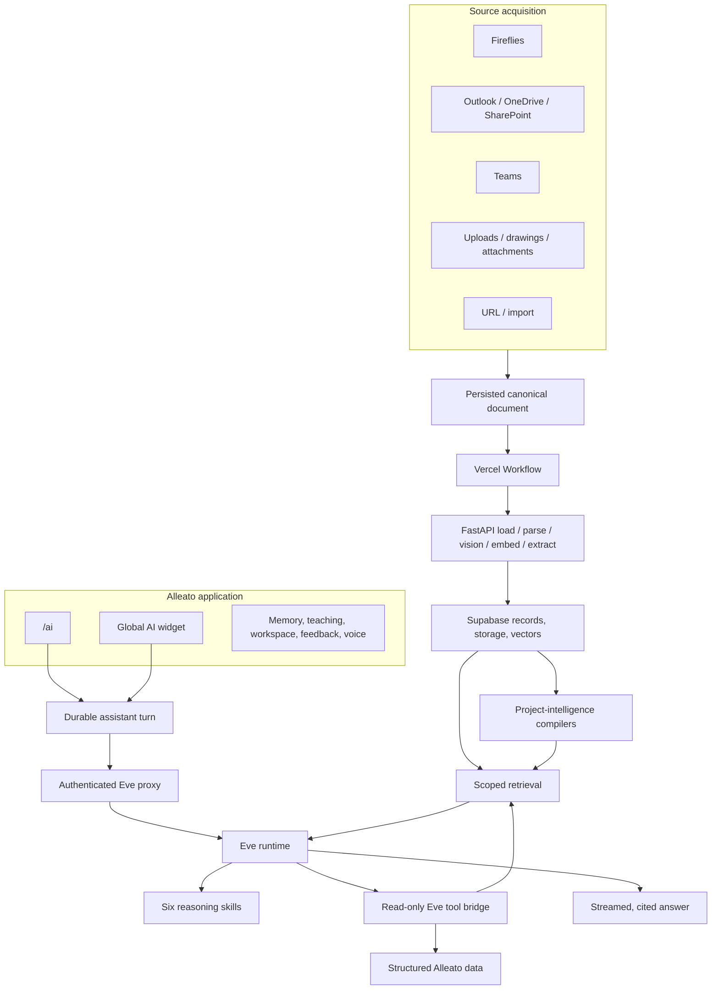

# Alleato AI and RAG Architecture

**Last audited:** 2026-07-30

**Last verified:** 2026-07-29

This document describes the current technical architecture only. The former
append-only history was removed because it contained deleted runtime paths and
conflicting ownership statements.

Read these companion documents:

- [`AI-ASSISTANT-FUNCTIONALITY.md`](./AI-ASSISTANT-FUNCTIONALITY.md) — complete
  user-facing capability catalog, status, and plain-language explanation.
- [`RAG-PIPELINE-OWNERSHIP.md`](./RAG-PIPELINE-OWNERSHIP.md) — exact source,
  workflow, processing, data, retrieval, and operational ownership.
- [`OCR-PIPELINE.md`](./OCR-PIPELINE.md) — drawing OCR contract.

## Architecture principles

1. One assistant identity and one generation runtime: Eve.
2. Skills are reasoning procedures inside Eve, not separate agents.
3. Source acquisition is separate from document processing.
4. Vercel Workflow is the sole durable document stage-order/retry owner.
5. FastAPI endpoints perform one stage; they do not orchestrate the sequence.
6. Structured data is preferred over narrative retrieval for numeric facts.
7. Retrieval is authorized by server-verified actor and project context.
8. Every important claim remains traceable to evidence.
9. Writes and external delivery fail closed until a separate governed Eve
   mutation boundary is production-ready.
10. Provider configuration and billing do not determine runtime ownership.

## System overview



## Assistant runtime

### Eve

`agents/alleato-assistant/**` is the sole `/ai` generation runtime.

Eve owns:

- assistant identity and instructions;
- reasoning and response generation;
- loading relevant specialist skills;
- selecting from the current request-scoped tool catalog;
- synthesizing structured and retrieved evidence;
- streaming the response; and
- stating evidence gaps.

Eve does not own source polling, ingestion, storage, OCR, parsing, embeddings,
extraction, project-intelligence compilation, or source scheduling.

### Runtime skills

```text
agents/alleato-assistant/agent/skills/
├── business-development.md
├── financial-analysis.md
├── marketing-strategy.md
├── operations-review.md
├── people-capacity.md
└── risk-review.md
```

Skills provide analysis procedure and safety rules. They do not grant tool or
data access.

### Authenticated proxy

Browser traffic reaches Eve only through:

```text
frontend/src/app/api/ai-assistant/eve/proxy/[...path]/
├── route.ts
└── eve-proxy.ts
```

The proxy:

- requires a signed-in Supabase user;
- binds the request to a durable assistant turn;
- verifies the assistant surface;
- verifies optional project access;
- adds trusted server-owned context;
- authenticates to Eve with the proxy secret; and
- normalizes and persists stream metadata needed by the app.

### Tool bridge

`frontend/src/app/api/ai-assistant/eve/tools/route.ts` is the only production
tool bridge used by Eve.

For each request it:

1. verifies the bearer token;
2. loads the signed-in user;
3. validates optional project access;
4. verifies the durable assistant turn;
5. verifies that the claimed surface matches the durable turn;
6. creates a request-scoped catalog;
7. rejects every write and external-delivery entry;
8. validates tool input;
9. executes the typed tool; and
10. verifies tool/project identity in the response.

The canonical registry contains 131 tools. The current Eve bridge exposes the
79 read-only entries. The complete catalog and plain-language descriptions are
in `AI-ASSISTANT-FUNCTIONALITY.md`.

## User interface and durable conversation state

| Component | Responsibility |
| --- | --- |
| `frontend/src/app/(main)/ai/page.tsx` | Canonical full-page assistant route |
| `frontend/src/components/ai-assistant/rag-chat-page.tsx` | Page composition, session selection, and chat layout |
| `frontend/src/components/ai-assistant/chat-area.tsx` | Composer, streaming messages, tool parts, citations, feedback, voice controls |
| `frontend/src/components/ai-assistant/conversation-sidebar.tsx` | Conversation list and lifecycle controls |
| `frontend/src/components/ai-assistant/global-ai-widget.tsx` | App-wide compact assistant surface |
| `frontend/src/hooks/use-alleato-eve-chat.ts` | Single Eve browser transport |
| `frontend/src/hooks/use-chat-session-messages.ts` | Persisted message/metadata hydration |
| `frontend/src/app/api/ai-assistant/conversations/**` | Conversation list/create/update/delete |
| `frontend/src/app/api/ai-assistant/messages/**` | Message persistence and reload |
| `frontend/src/app/api/ai-assistant/turns/route.ts` | Durable turn observation and supported cancellation behavior |

Connected-request stop is supported. Eve 0.22.6 does not provide durable
out-of-band cancellation, so the turn API returns a specific `501` instead of
claiming cancellation succeeded.

## Adjacent AI services

These services are part of the product but do not create a second chat
generation runtime:

| Service | Canonical API |
| --- | --- |
| User memories | `frontend/src/app/api/ai-assistant/memories/**` |
| Response and correction feedback | `frontend/src/app/api/ai-assistant/*feedback*/**` |
| Teach Alleato intake | `frontend/src/app/api/ai-assistant/teach/route.ts` |
| Skill library and feedback | `frontend/src/app/api/ai-assistant/skills/**` |
| Workspace artifacts | `frontend/src/app/api/ai-assistant/workspace/**` |
| Speech | `frontend/src/app/api/ai-assistant/speech/route.ts` |
| Cross-source timeline | `frontend/src/app/api/ai-assistant/timeline/route.ts` |
| Tavus avatar | `frontend/src/app/api/ai-assistant/avatar/conversation/route.ts` |
| Usage statistics | `frontend/src/app/api/ai-assistant/usage-stats/route.ts` |
| Marketing assets/calendar | `frontend/src/app/api/ai-assistant/marketing/**` |

The app may create or edit records through these dedicated authenticated APIs.
That does not mean Eve can perform the same mutation through chat.

## Canonical tool architecture

```text
frontend/src/lib/ai/
├── eve-runtime/
│   ├── canonical-tool-registry.ts
│   └── production-tool-registry.ts
├── tools/
│   ├── guardrails.ts
│   ├── tool-context.ts
│   ├── project-tools.ts
│   ├── action-tools.ts
│   ├── document-intelligence.ts
│   ├── executive-brief-tools.ts
│   ├── feature-request-tools.ts
│   ├── intelligence-tools.ts
│   ├── marketing.ts
│   ├── progress-report-tools.ts
│   ├── structured-output.ts
│   ├── web-search.ts
│   ├── workspace-tools.ts
│   └── read/rag-search-tools.ts
└── retrieval/
```

Each canonical tool definition declares:

- name and typed input;
- effect class: read, write, or external delivery;
- owning service;
- required permissions;
- approval requirement;
- allowed assistant surface;
- provider availability;
- project-scope requirement; and
- source family.

The current bridge adds read permission only. It does not add write or delivery
permission, and it explicitly fails if an unsafe entry crosses the boundary.

## RAG data path

### Acquisition

Each source adapter owns authentication, discovery, materialization, project
resolution, initial persistence, and workflow submission. Source owners include
Fireflies, Microsoft Graph, Teams, app uploads/attachments, drawing uploads,
URL ingestion, and controlled imports.

### Durable processing

`frontend/src/lib/rag-pipeline/process-document-workflow.ts` calls authenticated
FastAPI adapters in this order:

1. load;
2. parse;
3. vision;
4. embed; and
5. extract.

Workflow owns ordering and retry. FastAPI owns the implementation of each
stage. `/api/pipeline/process` is compatibility ingress only.

Each adapter executes only its named stage. In particular, Microsoft Graph
embedding consumes existing `document_page_intelligence` but never invokes the
vision analyzer. The Workflow-owned vision stage downloads eligible Graph PDFs
and persists page intelligence before embedding. Persisted Graph source values,
including `outlook_email`, `outlook_attachment`, and `teams_dm`, retain Graph
parse/extraction ownership rather than falling through to generic processors.

### Storage

- PM Supabase stores operational/source records and project intelligence.
- RAG Supabase stores chunks, vector embeddings, and retrieval metadata.
- Supabase Storage stores app-uploaded binary artifacts.
- Microsoft source URLs remain source-owned when the content is not copied to
  app storage.

### Retrieval

`frontend/src/lib/ai/tools/read/rag-search-tools.ts` and the shared retrieval
layer:

- apply authenticated project and organizational scope;
- constrain service-role vector reads;
- post-filter document, communication, and leadership-restricted evidence;
- retain source IDs and metadata for citations;
- use structured financial data for numeric financial truth; and
- fail loudly when no valid scope or evidence exists.

Existing chunk integrity and live retrieval passed on 2026-07-29. Source
freshness did not.

## Project intelligence

```text
backend/src/services/project_intelligence/
├── ownership.py
├── packet_repository.py
├── runner.py
├── targets.py
├── validation.py
└── projections/
    ├── current_state.py
    ├── domain_packets.py
    ├── operating_record.py
    ├── project_communications.py
    ├── report_suggestions.py
    ├── signal_candidates.py
    └── source_timeline.py
```

Project-intelligence services compile accepted source evidence into current
state, timelines, signal candidates, operating records, domain packets, and
report suggestions. Backend intelligence services also compile operating
summaries and evidence-quality metadata.

Eve reads these outputs. It does not compile or persist them.

## Provider architecture

| Workload | Primary provider path | Fallback |
| --- | --- | --- |
| Assistant/model generation | Vercel AI Gateway | Direct OpenAI where supported |
| Embeddings/vectorization | Vercel AI Gateway from Render | Direct OpenAI if configured |
| Drawing OCR | Azure Document Intelligence | None documented |
| Avatar conversations | Tavus | None documented |

`AI_GATEWAY_API_KEY` is the required primary Render AI provider credential.
`OPENAI_API_KEY` is fallback only. Adding Gateway credit does not change the
source, workflow, processing, data, retrieval, or assistant owner.

Secrets must never be printed or committed.

## Security boundaries

- User authentication: Supabase bearer identity.
- Project authorization: Supabase access check before project context is trusted.
- Turn binding: durable assistant turn ID.
- App-to-Eve trust: `EVE_PROXY_SECRET`.
- Workflow ingress trust: `RAG_PIPELINE_WORKFLOW_SECRET`.
- Workflow-to-stage trust: `ADMIN_API_KEY`.
- Retrieval isolation: tool scope, RPC filters, and post-filters.
- Leadership isolation: explicit leadership restriction at records, chunks, and
  service-role retrieval.
- Mutation safety: current Eve catalog is read-only.
- Built-in sandbox safety: Eve shell, file, arbitrary network, built-in web,
  todo, and child-session dispatch are disabled.

## Observability and verification

| Check | Purpose |
| --- | --- |
| `npm run verify:eve-only-runtime` | Fails if deleted frontend generator owners return |
| `npm run rag:verify:render-ai` | Verifies live backend/provider configuration |
| `npm run rag:verify:chunk-integrity` | Detects chunks without embeddings |
| `npm run rag:verify:control-plane` | Checks source, processing, extraction, and freshness health |
| `npm run rag:verify:retrieval-contract` | Verifies live scoped retrieval and authorization guardrails |
| `node scripts/verify/verify_render_rag_cron_health.mjs` | Audits required Render cron owners |
| `node scripts/ops/reconcile-render-rag-crons.mjs` | Guarded audit/reconciliation/run workflow |

Eve-specific tests:

```text
agents/alleato-assistant/
├── tests/auth.test.ts
├── tests/production-tools.test.ts
└── evals/executive-skills.eval.ts
```

The release gate is not satisfied by unit tests alone. It requires a deployed
record traced through acquisition, workflow, stages, storage, retrieval, and a
visible citation.

## Retired architecture

These paths are deleted and are not current extension points:

```text
frontend/src/app/api/ai-assistant/chat/
frontend/src/lib/ai/agents/
frontend/src/lib/ai/orchestrator.ts
frontend/src/lib/ai/bot-core.ts
frontend/src/app/(chat)/ai-assistant/
```

The former specialist identities were replaced by Eve's six skills. Historical
claims that the legacy handler, orchestrator, bot core, or specialist agents are
active are invalid.

ASRS is a separate product runtime and does not own `/ai`.

## Current operational status

As of 2026-07-30:

- Eve-only backup-repository guard: pass.
- Render backend and Gateway provider health: pass.
- Existing chunks and embeddings: pass.
- Live scoped retrieval: pass.
- Controlled live-data acquisition: pass; 21 Outlook and 33 Teams-DM records
  synchronized with zero errors on 2026-07-29.
- Newly acquired Outlook source-to-retrieval trace: pass; the project-scoped
  record became the top authorized result with citation metadata.
- SharePoint PDF stage-purity trace: pass; vision analyzed 7 pages and embedding
  persisted 3 text plus 7 vision-page chunks without executing vision internally.
- Controlled source acquisition: pass; Outlook, Teams DM, and Fireflies bounded
  sync paths completed on 2026-07-29.
- Source-health ownership repair: pass; retired teams_chat rows fell from 77
  to zero, total alerts fell from 289 to five, and the Graph aggregate now
  inherits the canonical `microsoft_graph_source_sync` receipt.
- Scheduled source-owner state: degraded and explicit; 57 SharePoint folders
  await bootstrap, 2,036 sampled documents lack chunks, one Graph subscription
  is outside configuration, 282 SharePoint documents lack project promotion,
  and Acumatica is blocked on the missing payment-application GI.
- Backlog drain contract: repaired in canonical production source; the Render
  Graph cron and its runner now share a 100-document embedding maximum, while
  AI Gateway and the required $10 daily model budget remain mandatory.
- Complete deployed source-to-retrieval/citation trace: pass for a controlled
  URL record.
- Canonical production repository contains the Eve/Workflow migration: pass.
- Live Render exposes authenticated `/api/pipeline/stages/{stage}`: pass.
- Canonical Vercel production exposes the Eve proxy and Workflow ingress: pass.
- Authenticated app-to-Eve lifecycle: pass; start `202`, stream `200`, terminal
  turn `completed`, with temporary verification data cleaned up.

The architecture is cut over in canonical production. Durable run
`wrun_01KYR3MKXQEHC80QFCB56TSD5F` completed all five stages on its first
attempt, persisted five embedded chunks, and returned the controlled document
as the top project-scoped vector result at similarity `1.0`. Remaining work is
the named source queues, the Acumatica provider contract, and governed write
enablement, not another assistant-runtime redesign.
