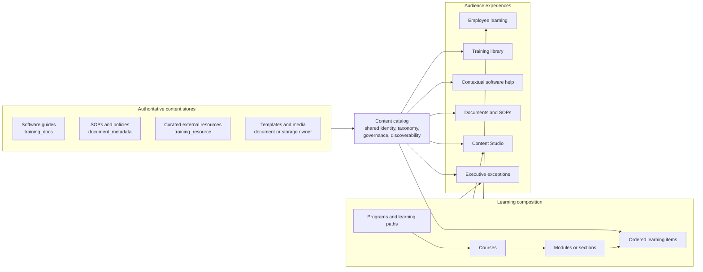

# Knowledge and Learning Architecture

Status: Implemented foundation
Decision owner: Executive team and product owner
Implementation owner: Engineering
Last audited: 2026-07-30

## Implementation Result

The foundation is live in the linked Supabase project. The implementation
preserves source ownership while adding one catalog identity, shared taxonomy,
course composition, programs, assignments, enrollments, progress, events,
read models, and failure-loudly mutation contracts.

Employee delivery now uses `/training`, `/training/library`,
`/training/courses/[courseSlug]`, `/training/learn/[enrollmentId]`, and the
canonical `/training/guides/[guideSlug]` reader. Content Studio at `/content`
provides the shared creator front door and routes each type to its specialized
owner. `/training/manage` provides the administration exception view.

Applied migration versions:

- `20260730220949` knowledge and learning foundation
- `20260730222513` enrollment enum casts
- `20260730230400` security-invoker read views
- `20260730231500` internal course catalog kind
- `20260730231600` existing course catalog repair
- `20260730234500` released-course, learner-access, and atomic-resource guards
- `20260730235200` relation-safe learner progress guard
- `20260730235800` software-guide delivery metadata projection

## Decision

Alleato should use one shared content catalog, separate authoritative content
stores, and a composable learning layer.

The catalog gives every guide, SOP, resource, video, template, and policy one
queryable identity. It does not copy or replace the authoritative body. Courses
and modules reference catalog items in an ordered learning structure. This
allows the same SOP, software guide, or video to appear in the resource library,
inside a course, in contextual help, and in a role-based onboarding plan without
duplicating the content.

Do not create one large training table. Do not treat a course as the same kind of
record as a document or video.



## Why the Current Model Is Becoming a Ball of Mud

The audit found four overlapping product and storage models:

1. A curated resource library based on `training_resource`, topics, roles, and
   skills.
2. A software documentation authoring system based on `training_docs`,
   `training_doc_steps`, assets, and relations.
3. Static MDX guides and hard-coded training modules owned by frontend code.
4. SOP requirements and SOP-like files owned by the Documents domain through
   `sop_backlog` and `document_metadata`.

The product navigation exposes these storage boundaries directly as Training,
Training Library, Training Docs, Training Data, and App Knowledge. This forces
employees and content creators to understand the database instead of the
purpose of the content.

The concrete gaps are:

- `training_resource_type` contains `video`, `doc`, and `course`, mixing a
  delivery format with a structured learning experience.
- There are no course, module, ordered lesson, assignment, enrollment, or
  learner-progress tables.
- Static guides and hub modules have a different owner and publishing path from
  database-backed content.
- Core query dimensions are split between text columns, metadata, and parallel
  role and topic tables.
- The normal management experience is partly a raw table editor.
- Publishing status exists, but the quality gate is not enforced.
- The UI calls software documentation "internal SOPs," even though SOPs have a
  separate canonical Documents owner.

## Current Data Evidence

The 2026-07-30 read-only production-linked schema audit found:

| Domain | Current state | Architectural implication |
| --- | --- | --- |
| Curated resources | 97 records: 73 docs, 22 videos, and 2 courses | The 2 course records need reclassification or migration into structured courses. |
| Resource lifecycle | 67 published, 28 in review, 2 archived | Lifecycle states exist but are not shared across content domains. |
| Software docs | 91 records: 69 draft and 22 published | This is already a meaningful authoring system and should be reused. |
| Documentation QA | All 91 records are `not_tested` | Publication currently fails to prove tested instructions. |
| Documentation steps and assets | 118 steps and 124 assets | Structured guide content already has value and should not be flattened. |
| Roles and skills | 6 training roles, 53 role-skill links | These need mapping to company roles rather than becoming a second employee identity system. |
| Coaching and progress | 4 skill check-ins, 0 coaching sessions | Existing growth records do not provide LMS assignment or completion semantics. |
| Controlled SOP documents | 4 confirmed authoritative SOP files in Documents | Backfill only records explicitly categorized or typed as SOP. The other 23 search matches were meetings or references that merely mentioned SOPs. |

## Domain Language

These terms must have one meaning in the database, authoring UI, and employee
experience.

| Term | Meaning |
| --- | --- |
| Content item | The shared catalog identity for one reusable piece of knowledge or practice. |
| Resource | An atomic item such as a guide, SOP, video, template, checklist, policy, or reference. |
| Software guide | Reference documentation for using the Alleato application. It is usually consumed at the moment of need. |
| SOP | A controlled operational document. Its authoritative copy remains in Documents. |
| Module | An ordered section inside a course. It is a container, not a file format or standalone resource type. |
| Course | An outcome-based sequence of modules and learning items with completion criteria. |
| Program or learning path | An ordered or grouped set of courses for onboarding, a role, or professional growth. |
| Assignment | A requirement or recommendation connecting a person, team, or role to a course or content item. |
| Enrollment | A learner's instance and state for a course. |
| Progress | Completion, score, evidence, and timestamps for assigned learning items. |

Documentation and training are related but not interchangeable. Documentation
answers "how do I do this now?" Training answers "what should I learn, in what
order, and how do we know I completed it?"

## Source-of-Truth Boundaries

### Software Guides

Keep `training_docs`, steps, assets, and relations as the initial authoritative
store for application guides. Rename the product language to Software Guides or
App Knowledge. A later migration may rename the tables, but a table rename is
not required to establish the boundary.

Customer-facing publication remains owned by the separate
`The-Alleato-Group/alleato-docs-site` repository. The catalog stores the internal
content identity and publication relationship, not a second public-docs body.

### SOPs, Policies, and Controlled Documents

Keep authoritative SOP and policy content in `document_metadata` and the
Documents workflow. Add an enforced `document_type` or content-type relationship
for SOP, policy, checklist, and template. A catalog row references the document.

Courses may reuse an SOP, but they must not copy its body. Updating the
authoritative SOP must update every course and library surface that references
it.

### Curated External Resources

Keep `training_resource` as the initial source for vetted links, videos, and
external files. Remove `course` from its type contract after migrating the two
existing course records. Provider and format belong to the resource record;
audience, role, skill, topic, and governance belong to the shared catalog.

### Static Training Guides

Migrate the four MDX guides and eight hard-coded hub modules into catalog-backed
content and learning structures. Frontend code must not remain the content
management system.

## Proposed Data Model

Names are intentionally explicit. Final migration names should be validated
against the refreshed Supabase types before database code is written.

### Shared Catalog

`knowledge_native_content`

- Stores database-native internal articles, handbook content, and assessments
  that have no separate authoritative source.
- Replaces frontend MDX as a content management boundary without forcing
  software guides, SOPs, or external resources into a generic body table.

`knowledge_content_item`

- `id`
- `slug`
- `title`
- `summary`
- `content_kind`
- `lifecycle_status`
- `visibility`
- `source_type`
- `source_id`
- `source_url`
- `owner_user_id`
- `reviewer_user_id`
- `published_at`
- `last_reviewed_at`
- `next_review_at`
- `created_at`
- `updated_at`

Recommended `content_kind` values:

- `software_guide`
- `sop`
- `policy`
- `reference`
- `video`
- `template`
- `checklist`
- `article`
- `assessment`
- `external_course`

Recommended `source_type` values:

- `training_doc`
- `document`
- `training_resource`
- `native_content`
- `learning_course`

The pair `(source_type, source_id)` must be unique. A database constraint or
trigger must reject a source reference that does not exist.

### Canonical Taxonomy

Use normalized dimensions and join tables for:

- topics
- company roles
- skills
- departments or business areas
- audiences
- projects, only where project-specific content is intentional

Do not use free-text `track`, arbitrary JSON metadata, or duplicated role names
for dimensions that must be filtered, assigned, or reported. Map the existing
`training_role` records to canonical company roles. `user_profiles.role` may be
used as a temporary identity source, but it is not a sufficient long-term
taxonomy contract on its own.

### Learning Composition

`learning_program`

- Represents onboarding, role development, leadership development, or another
  multi-course path.

`learning_program_course`

- Orders courses within a program.

`learning_course`

- Owns title, outcome, difficulty, estimated duration, prerequisites, status,
  owner, reviewer, and completion rule.

`learning_course_section`

- An ordered module or section within a course.

`learning_course_item`

- An ordered reference to `knowledge_content_item`.
- May add instructional framing, required or optional state, estimated time,
  and a completion rule without copying the source content.

The same content item can appear in many courses. Deleting or archiving a
referenced content item must fail loudly and show every affected course.

### Assignment and Learner State

`learning_assignment`

- Targets a person, canonical role, department, team, or onboarding cohort.
- Records required or recommended state, due date, assigner, and reason.

`learning_enrollment`

- One learner-course instance with assigned, in-progress, completed, overdue,
  waived, or cancelled state.

`learning_item_progress`

- Records learner, enrollment, course item, state, started and completed
  timestamps, score, evidence, and attempt count.

`learning_event`

- Optional append-only audit log for actor, action, object, timestamp, and
  context.
- Add only when auditability or integrations justify it. It should not replace
  the simpler current-state tables.

### Read Models

Product pages should query stable views or services rather than reconstructing
the model independently:

- `knowledge_content_catalog_view`
- `training_library_view`
- `software_guides_view`
- `sop_catalog_view`
- `learner_assignments_view`
- `learner_course_progress_view`
- `content_governance_exceptions_view`

## Lifecycle and Publishing Governance

Use one lifecycle vocabulary:

```text
draft -> in_review -> approved -> published -> archived
```

Revisions to published content create a draft revision while the current
published revision remains available.

Publishing rules differ by content kind:

| Content kind | Required before publication |
| --- | --- |
| Software guide | Owner, reviewer, successful QA run, source route, and supported audience |
| SOP or policy | Document owner approval, effective date, review date, and authoritative file |
| External resource | Owner, valid URL, freshness check, audience, and topic |
| Course | Owner, outcome, at least one module and item, all required items publishable, and completion rule |

The system must reject publication with a specific actionable reason. Published
software guides with `not_tested` QA must become impossible after the migration
and remediation period.

Archive should normally preserve history and block new assignment. Destructive
deletion is reserved for unreferenced drafts.

## Permissions

Use capabilities, not page-specific role checks.

| Capability | Employee | Content creator | Reviewer | Learning admin | Executive |
| --- | --- | --- | --- | --- | --- |
| View permitted content | Yes | Yes | Yes | Yes | Yes |
| Complete assigned learning | Yes | Yes | Yes | Yes | Yes |
| Create and edit drafts | No | Yes | Yes | Yes | Optional |
| Approve or reject | No | No | Yes | Yes | Optional |
| Publish | No | No | By policy | Yes | No |
| Build courses and programs | No | Assigned scope | Review | Yes | No |
| Assign required learning | No | No | No | Yes | Assigned scope |
| View company-wide exceptions | No | No | Limited | Yes | Yes |
| Manage taxonomy and permissions | No | No | No | Yes | No |

Content visibility is separate from authoring capability. At minimum support
internal, leadership, department, role, project, and public/customer audiences.

## Frontend Information Architecture

### Employee Experience

`/training`

- Primary job: continue or complete the right learning.
- Show assigned, in-progress, and role-recommended learning.
- Keep growth storytelling secondary to the employee's next action.

`/training/library`

- Primary job: find a useful content item or course.
- Search and filter by content kind, topic, role, skill, department, level, and
  format.
- A course is visually distinct from an atomic resource.

`/training/courses/[courseSlug]`

- Show outcome, audience, prerequisites, modules, time, and completion rule.
- Primary action: start or continue.

`/training/learn/[enrollmentId]`

- Focus on the current learning item, course outline, completion state, and next
  step.

`/knowledge/app`

- Remains the contextual software guide experience.
- Uses the shared catalog and Software Guides source, but does not become a
  course runner.

`/documents`

- Remains the authoritative SOP, policy, checklist, and template experience.
- Adds reliable type and audience filters from the shared taxonomy.

### Content Studio

Replace raw training table management for normal creators with `/content`.

The Content Studio contains:

1. A content catalog with type, lifecycle, owner, audience, and review-due
   filters.
2. A type-aware creation flow for Software Guide, SOP or Document, Resource, and
   Course.
3. Editors that reuse the existing guide authoring and document capabilities.
4. A course builder that assembles reusable catalog items into ordered modules.
5. A review and publishing queue with explicit blockers.
6. A taxonomy area available only to learning administrators.

Keep `/training-data` only as a developer or owner diagnostic surface. It must
not be the content creation workflow.

### Executive and Learning Administration

Use `/training/manage` for decisions and exceptions:

- overdue required learning
- unassigned onboarding requirements
- content without an owner
- content due for review
- failed freshness checks
- publication blocked by QA
- role or skill coverage gaps

Use a prioritized exception table with drill-downs. Do not use vanity counts or
top-of-page KPI cards as the primary experience.

## Content Studio Interaction Model

The list page owns discovery and bulk governance actions. The editor owns one
content item. The course builder owns composition.

For a course builder, use the shared split-page workspace only where all three
regions are necessary:

- left: ordered course outline
- center: selected module or item settings
- right: searchable source picker and item details

Do not wrap each region in decorative cards. Use typography, whitespace,
dividers, selection state, and a single primary action.

## API and Service Boundaries

Create one application service for catalog reads and governance:

- `listContent`
- `getContent`
- `createContentIdentity`
- `submitForReview`
- `approveRevision`
- `publishRevision`
- `archiveContent`
- `listPublicationBlockers`

Create a separate learning service:

- `createCourse`
- `updateCourseOutline`
- `validateCourse`
- `assignLearning`
- `startEnrollment`
- `completeLearningItem`
- `getLearnerHome`

Routes and components must call these owners. Direct table-by-table product
logic should be limited to the diagnostic console.

## Failure-Loudly Contract

| Failure | Required behavior |
| --- | --- |
| Source item is missing | Block display or publication, name the missing source, and show the owning record. |
| Referenced item is archived | Block new assignments and list affected courses. |
| Content is not QA-approved | Block publication with the exact failed or missing check. |
| Course has no completion rule | Block publication and link to the course setting. |
| Learner lacks permission | Show that access is restricted and identify the content owner or request path. |
| Taxonomy value is invalid | Reject the write; never silently store a new free-text variant. |
| Assignment cannot resolve a target | Reject assignment and list unmatched people or roles. |
| Source URL fails freshness check | Flag it for review; do not silently remove learner history. |

## Migration Sequence

### Phase 0: Freeze and Contract

- Pause new training tables and standalone management pages.
- Approve this vocabulary, source ownership, lifecycle, and route ownership.
- Name a business owner for each content kind and taxonomy.

### Phase 1: Catalog Without Breaking Current Sources

- Refresh Supabase types.
- Add shared catalog, taxonomy joins, governance fields, constraints, and read
  views.
- Backfill `training_docs`, `document_metadata` SOPs, and
  `training_resource`.
- Produce duplicate, orphan, missing-owner, and invalid-taxonomy reports.
- Do not copy authoritative bodies.

### Phase 2: Courses and Learner State

- Add program, course, module, ordered item, assignment, enrollment, and
  progress tables.
- Reclassify the two current externally hosted course links as
  `external_course`. Only create an Alleato course when Alleato owns an ordered
  learning sequence and its completion contract.
- Establish completion and archive rules.

### Phase 3: Content Studio

- Build the catalog, type-aware editors, source picker, course builder, review
  queue, and governance exceptions.
- Reuse the current Training Docs editor and Documents capabilities through
  adapters rather than duplicating their forms.

### Phase 4: Employee Experience

- Rebuild Training as learner home.
- Connect Library, course overview, learner runner, contextual App Knowledge,
  and Documents filters to the shared read models.
- Preserve useful URLs with redirects.

### Phase 5: Static Content Migration

- Import the four MDX guides.
- Convert the eight hard-coded hub modules into catalog items, courses, or
  navigation based on their actual purpose.
- Remove frontend code as a content source.

### Phase 6: Governance Hardening

- Enforce QA and ownership publication guards.
- Add review reminders, freshness jobs, exception reporting, audit history, and
  end-to-end tests.

## Acceptance Contract for Implementation

Implementation is not complete until the following journey works:

1. A creator makes or links a content item.
2. A reviewer sees specific publication blockers and approves a valid revision.
3. A learning admin reuses that item inside a course without copying it.
4. The course is assigned by person or canonical role.
5. The employee starts, resumes, and completes it.
6. Progress appears in the learning administration exception view.
7. Updating the source item updates every consuming surface while preserving
   completion history.

Required guardrails:

- database constraints for source identity, ordering, and allowed lifecycle
  transitions
- a test that required-QA content cannot publish as `not_tested`
- a test that a referenced source cannot be destructively deleted
- a migration duplicate and orphan report
- author to review to publish integration coverage
- assignment to completion end-to-end coverage
- route tests preventing a new training management surface from bypassing the
  Content Studio owner

## Explicit Non-Goals

- Replacing the public documentation repository or Mintlify deployment.
- Moving authoritative SOP bodies out of Documents.
- Implementing SCORM, certificates, or a full external LMS before Alleato has a
  confirmed business requirement.
- Adopting xAPI as a prerequisite for basic assignment and completion.
- Preserving raw database tables as the content creator experience.

## Architecture Rationale

Enterprise content-management practice favors centrally managed content types
and metadata so content can be searched, governed, and reused independently of
its folder or storage location. Learning platforms distinguish a course from
the resources and activities placed inside its ordered sections. This design
uses those principles while preserving Alleato's existing Supabase, Documents,
software-guide, and frontend investments.
