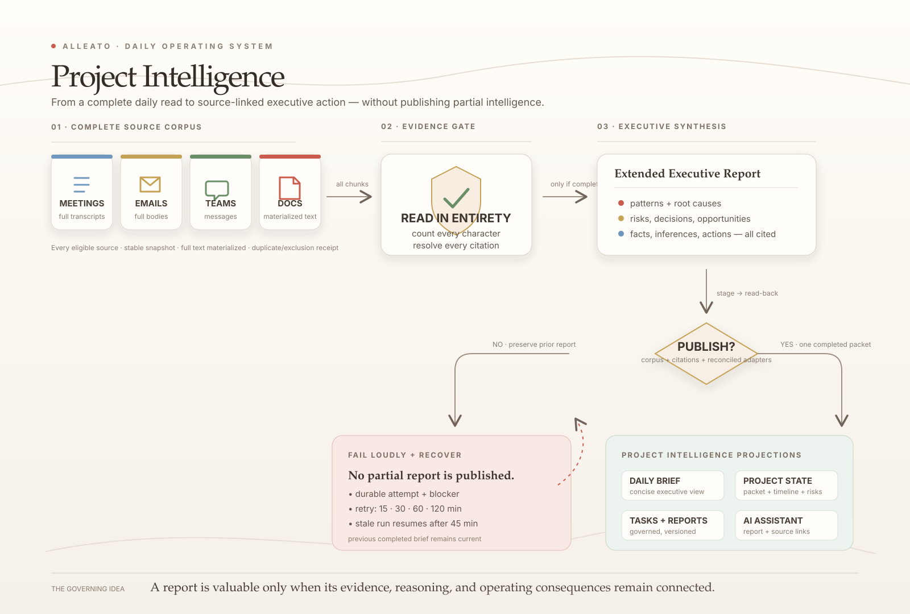
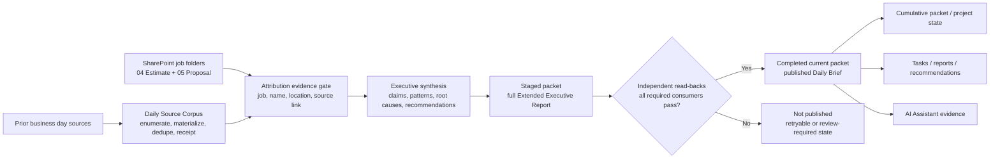

# Project Intelligence Architecture

**Status:** canonical production reference  
**Last verified:** 2026-07-22
**Domain glossary:** [`CONTEXT.md`](../../CONTEXT.md)  
**Operational procedure:** [`docs/ops/project-intelligence-runbook.md`](../ops/project-intelligence-runbook.md)



## Purpose

Project Intelligence is the governed daily operating workflow for Alleato. Each
morning it reads the prior business day's eligible meeting transcripts, emails,
Teams messages, and documents in full; produces a durable, source-linked
Extended Executive Report; and updates the projections used by projects,
reports, recommendations, and the AI Assistant.

It is a fail-closed evidence pipeline, not selected search snippets in one
prompt. Incomplete source coverage, missing content, unresolved citations, or
failed required projections prevent publication.

## Canonical artifacts and authority

| Artifact | Authority | Owner | Purpose |
| --- | --- | --- | --- |
| Daily Source Corpus | Observed source material | `project-intelligence/ingestion/daily-source-corpus.mjs` | Complete source set and read receipt. |
| SharePoint attribution evidence | Authoritative project identity | `project-intelligence/core/project-attribution-evidence.mjs` | Job number, project name, location, proposal/estimate path, and source URL used before synthesis. |
| Executive Intelligence Run | Workflow control record | `ai_work_runs` and scheduler | Attempts, retries, failure state, recovery. |
| Extended Executive Report | Derived durable analysis | `intelligence_packets.packet_json.briefMarkdown` | Full report of record. |
| Daily Brief projection | Derived presentation | `/daily-brief` | Concise, scannable executive view. |
| Product Intelligence Packet | Derived cumulative memory | `project_intelligence_packet_items` | Project timeline, risks, decisions, opportunities. |
| Project operating record | Derived controlled projection | `project_current_state` | Project homepage/intelligence state. |
| Tasks and responsibilities | Governed operational projection | `tasks` plus task-governance metadata | Bounded commitments, never role-description noise. |
| Weekly reports | Governed internal/client projection | `project_progress_reports` + versions | Reviewable weekly narrative. |
| Recommendations | Governed proposed action | Project-control recommendation adapter | Human-approved operating actions. |

`intelligence_packets` is the publication source of truth. A packet may be read
as current only when it is `fresh`, `current`, has a completed run contract,
and contains durable report markdown. The truncated `executive_summary` column
is never a substitute for the full report.

## Complete repository file tree

This is the complete **direct ownership tree** for Project Intelligence as of
2026-07-22: every runtime entry point, direct dependency, projection, UI/API
surface, migration, test, operational document, and retained historical
artifact that belongs to this workflow. It deliberately distinguishes the
scheduled production path from manual repair tools and historical evidence.
Generic shared platform code (for example, the common database client,
authentication middleware, or the upstream Microsoft/Fireflies ingestion
workers) is not duplicated below merely because the workflow reads data they
previously wrote to `document_metadata`.

```text
project-management/
├── project-intelligence/
│   ├── core/
│   │   ├── compile-daily-executive-brief.mjs        # corpus → report → staged packet
│   │   ├── brief-v3.mjs                             # typed report validation/rendering
│   │   ├── brief-v3-response-schema.mjs             # AI Gateway JSON Schema output contract
│   │   ├── model-transport.mjs                      # provider selection, timeout, failover
│   │   ├── executive-synthesis.mjs                  # deep report + structured brief synthesis gates
│   │   ├── project-records.mjs                      # bounded project operating-record extraction
│   │   ├── packet-repository.mjs                    # atomic staged-packet persistence
│   │   ├── project-attribution-evidence.mjs         # SharePoint proposal/estimate identity gate
│   │   ├── executive-intelligence-run.mjs           # publishability contract
│   │   ├── ownership-contract.mjs                   # canonical-path guard
│   │   └── __tests__/                               # core contract and synthesis tests
│   ├── runner/                                      # only canonical scheduled Daily Brief executable
│   │   ├── run-scheduled-daily-executive-brief.mjs  # lock, retries, idempotency, read-back
│   │   ├── daily-executive-brief-schedule.mjs       # New York business-date / DST policy
│   │   ├── executive-intelligence-recovery.mjs      # bounded recovery policy
│   │   └── __tests__/                               # runner/schedule/recovery tests
│   ├── projections/
│   │   ├── daily-deep-read-consumers.mjs            # projection data adapters + evidence previews
│   │   ├── projection-fanout.mjs                    # reconciled required-consumer transaction
│   │   ├── run-consumers.mjs                        # child-process invocation + completed receipt gate
│   │   └── __tests__/run-consumers.test.mjs
│   ├── web/                                         # read-only route/UI adapters (migration target)
│   ├── ingestion/
│   │   ├── daily-source-corpus.mjs                  # complete enumeration/materialization
│   │   ├── rag-database-connection.mjs              # RAG connection contract
│   │   └── __tests__/daily-source-corpus.test.mjs
│   └── maintenance/                                 # manual-only; never cron
│       ├── daily-deep-read-backfill.mjs
│       └── operational-loss-baseline.mjs
├── render.yaml                                      # production cron declaration + schedule env
├── backend/
│   ├── Dockerfile.executive-brief                    # cron image; starts project-intelligence/runner
│   └── src/services/integrations/microsoft_graph/
│       ├── client.py                                 # authenticated Microsoft Graph client
│       ├── sync.py                                   # scheduled SharePoint folder enumeration
│       └── onedrive.py                               # SharePoint file metadata/materialization
├── package.json                                      # intelligence:* and verification commands
├── scripts/
│   └── verify/
│       ├── app-db-connection.mjs                     # compiler/scheduler database connection seam
│       ├── daily-brief-source-of-truth.mjs           # canonical packet/detail-route guard
│       ├── verify_ai_intelligence_packet_contract.mjs
│       ├── verify_daily_executive_brief_schedule.mjs
│       ├── verify_executive_daily_brief_fresh.mjs
│       ├── verify_executive_daily_brief_gateway.mjs
│       └── verify_project_intelligence_packet_freshness.mjs
├── frontend/
│   ├── scripts/
│   │   ├── run-executive-daily-brief.ts              # local/operator invocation adapter
│   │   ├── regenerate-executive-briefing.ts          # explicit regeneration utility
│   │   ├── preview-daily-brief-text.ts               # report-preview utility
│   │   ├── evaluate-executive-brief-reference.ts     # reference-quality evaluation
│   │   └── verify-executive-daily-brief-ledger-integration.ts
│   └── src/
│       ├── app/
│       │   ├── daily-brief/page.tsx                  # concise current Daily Brief projection
│       │   ├── (tables)/daily-briefs/
│       │   │   ├── page.tsx                           # report-history table
│       │   │   └── [briefId]/page.tsx                 # full persisted BriefMarkdown report
│       │   ├── (main)/[projectId]/intelligence/
│       │   │   ├── page.tsx                           # project intelligence reader/control surface
│       │   │   ├── error.tsx
│       │   │   └── sources/[sourceDocumentId]/page.tsx # original-source context route
│       │   ├── (main)/[projectId]/progress-reports/   # internal/client report review + refinement UI
│       │   ├── (admin)/admin/daily-briefs/            # admin history, detail, and fan-out control
│       │   ├── (admin)/intelligence-packets/          # packet inspection UI
│       │   ├── api/cron/executive-daily-brief/
│       │   │   ├── route.ts                           # authenticated cron/API trigger
│       │   │   └── __tests__/route.test.ts
│       │   ├── api/executive/daily-brief/             # packet read, history, PDF, tasks, feedback, delivery
│       │   ├── api/executive/intelligence-brief/route.ts
│       │   ├── api/executive/intelligence-stats/route.ts
│       │   ├── api/executive/daily-deep-read-candidates/[candidateId]/route.ts
│       │   ├── api/projects/[projectId]/intelligence/daily-deep-read-candidates/
│       │   │   ├── [candidateId]/route.ts
│       │   │   ├── [candidateId]/promote/route.ts
│       │   │   └── promote/route.ts
│       │   ├── api/progress-reports/route.ts
│       │   └── api/projects/[projectId]/progress-reports/ # create/read/refine/PDF/email/history/AI routes
│       ├── features/
│       │   ├── daily-briefs/
│       │   │   ├── brief-markdown.tsx                 # full-report renderer
│       │   │   ├── daily-brief-detail-client.tsx
│       │   │   ├── daily-briefs-table-config.tsx
│       │   │   └── admin-daily-briefs-table-config.tsx
│       │   └── intelligence/
│       │       ├── project-intelligence-workflow.tsx
│       │       ├── daily-deep-read-candidate-review.tsx
│       │       ├── daily-deep-read-central-review.tsx
│       │       ├── daily-ingestion-feed.tsx
│       │       └── __tests__/project-intelligence-workflow.test.tsx
│       ├── hooks/use-daily-brief-history.ts
│       ├── lib/
│       │   ├── daily-briefs/
│       │   │   ├── canonical-packets.ts               # `daily-executive-brief` packet owner
│       │   │   ├── daily-deep-read-promotion.ts       # promotion/read-back contract
│       │   │   ├── fanout-readback.ts                 # required consumer validation
│       │   │   ├── source-links.ts                    # source provenance rendering
│       │   │   ├── brief-v3-types.ts
│       │   │   ├── brief-view-model.ts
│       │   │   ├── render-brief-v3.ts
│       │   │   ├── brief-pdf.ts
│       │   │   ├── canonical-teams-delivery.ts
│       │   │   ├── morning-brief-tasks.ts
│       │   │   └── admin-history.ts
│       │   ├── ai-ops/
│       │   │   ├── executive-intelligence-run-state.ts
│       │   │   ├── executive-daily-brief-workflow.ts
│       │   │   ├── executive-daily-brief-evidence.ts
│       │   │   ├── executive-daily-brief-ledger.ts
│       │   │   ├── daily-brief-canonical-link.ts
│       │   │   ├── source-adapters.ts
│       │   │   ├── contracts.ts
│       │   │   ├── ledger.ts
│       │   │   ├── delivery-router.ts
│       │   │   └── tool-registry.ts
│       │   ├── ai/intelligence/
│       │   │   ├── packet-service.ts                  # project packet read/write service
│       │   │   ├── packet-fast-path.ts
│       │   │   ├── advisor-synthesis.ts
│       │   │   ├── project-control-recommendations.ts
│       │   │   ├── page-state.ts
│       │   │   ├── db-fallback.ts
│       │   │   ├── types.ts
│       │   │   └── utils.ts
│       │   ├── progress-reports/
│       │   │   ├── assemble-from-deep-read.ts
│       │   │   ├── deep-read-signals.ts
│       │   │   ├── ai-generate.ts
│       │   │   ├── server.ts
│       │   │   ├── report-builder.ts
│       │   │   ├── ai-notifications.ts
│       │   │   ├── pdf.ts
│       │   │   └── types.ts
│       │   └── executive/
│       │       ├── canonical-operating-packet.ts
│       │       ├── executive-state.ts
│       │       ├── executive-system-health.ts
│       │       ├── executive-claim-lineage.ts
│       │       ├── governed-executive-artifact.ts
│       │       └── executive-intelligence-routing.ts
│       └── types/database.types.ts                    # generated schema contract
├── backend/src/services/project_intelligence/
│   ├── runner.py                                      # only backend scheduled executable
│   ├── ownership.py                                   # former-path ownership guard
│   ├── targets.py                                     # canonical client-project target resolution
│   ├── validation.py                                  # raw-source and synthesis publication guards
│   ├── packet_repository.py                           # packet-item persistence/read owner
│   └── projections/
│       ├── current_state.py                           # rolling project-state packet
│       ├── project_communications.py                  # email/Teams extraction + daily sweep
│       ├── domain_packets.py                          # company-process packet projection
│       ├── signal_candidates.py                       # canonical staged-signal/card projection
│       ├── source_timeline.py                         # timeline/source/change-candidate final writers
│       ├── report_suggestions.py                      # daily/weekly suggestion final writer
│       └── operating_record.py                        # snapshot/current-state final-writer boundary
├── backend/tests/
│   ├── test_product_intelligence_packets.py
│   ├── test_deep_project_intelligence.py
│   ├── test_project_intelligence_targets.py
│   ├── test_project_intelligence_validation.py
│   ├── test_project_intelligence_signal_candidates.py
│   ├── test_project_intelligence_timeline_projection.py
│   ├── test_project_intelligence_report_suggestions.py
│   ├── test_project_intelligence_operating_record.py
│   ├── test_project_synthesizer_budget.py
│   └── test_project_intelligence_runner.py
├── supabase/migrations/
│   ├── 20260430095000_ai_intelligence_packets.sql
│   ├── 20260502013000_executive_briefing_workflow.sql
│   ├── 20260714072000_daily_deep_read_fanout_runs.sql
│   ├── 20260714090000_daily_brief_operational_loss_occurrences.sql
│   ├── 20260716110000_control_project_current_state_projection.sql
│   ├── 20260716113000_bound_daily_projection_fallback.sql
│   ├── 20260716201026_create_executive_artifact_versions.sql
│   ├── 20260721130000_project_intelligence_packet_items.sql
│   ├── 20260721143000_governed_project_synopsis.sql
│   ├── 20260721200000_add_executive_intelligence_run_state.sql
│   └── 20260721213000_executive_intelligence_schedule_recovery.sql
└── docs/
    ├── architecture/
    │   ├── PROJECT-INTELLIGENCE.md                    # this canonical document
    │   ├── project-intelligence-workflow.svg          # visual architecture
    │   ├── content-source-and-operating-record-design.md # historical design notes; not runtime authority
    │   └── executive-intelligence-adapter-registry.json
    └── ops/
        ├── project-intelligence-runbook.md             # operator procedure
        ├── tasks/2026-07-21-project-intelligence-production-closeout.md
        ├── handoffs/2026-07-21-SROOT-project-intelligence-closeout.md
        └── evidence/
            ├── project-intelligence-closeout/          # current closeout screenshots
            └── runtime/daily-executive-brief/          # runtime source-corpus receipts
```

### Historical and archived-code audit

No active Project Intelligence runtime file is stored in an `archive`,
`archived`, `legacy`, `deprecated`, or `retired` code directory. The scheduled
workflow does not call a legacy “daily digest” path; repository matches for
that phrase are unrelated product copy, historical documentation, or migration
history.

The repository does retain historical records on purpose:

- `docs/ops/evidence/**` and `docs/ops/handoffs/**` preserve prior run proof,
  audits, and handoffs; they are not executable code.
- `docs/architecture/content-source-and-operating-record-design.md` is
  explicitly historical design context; this document is the runtime authority.
- `supabase/migrations/_ignored_legacy/**` is an explicitly ignored migration
  archive. It contains no Project Intelligence runtime migration and is not
  applied by the current workflow.
- The remaining `project-intelligence/maintenance/` utilities identified above are
  active manual tools, not archived code and never cron targets.

If a new runtime path is added, update this tree in the same change. If a
runtime file is replaced, delete the former functional implementation in that
same change. Do not retain an archived, legacy, deprecated, retired, or
compatibility code copy in the repository; Git history is the recovery record.

## End-to-end flow



The Daily Brief page is downstream of the full report. It summarizes the
authoritative report; it does not generate or replace it.

## Complete-source and provenance contract

For a business date, every eligible source is enumerated from a stable snapshot.
A source is complete only when its full text is materialized and all chunks are
presented to synthesis. The run retains:

- lane status: `complete`, `valid-empty`, or `failed`;
- eligible/materialized source and character counts;
- model-input character counts and zero-truncation accounting;
- exclusions and deduplications with reasons;
- source identity, lane, timestamp, project association, and URL when present.

An intentionally empty lane is valid. An unread lane is a failed run, not an
empty one. Every claim-bearing output retains source ID, lane, canonical URL
when available, packet/report ID, and run context. Facts, inferences,
recommendations, risks, opportunities, and evidence gaps remain distinct.

### SharePoint attribution contract

Before any source is chunked for a model, the compiler enumerates indexed files
whose paths are inside `04 - Estimate` or `05 - Proposal`. The job-folder path
is parsed into job number, project name, city, and state and reconciled with the
canonical `projects` registry. The source manifest records the evidence path
and URL, the profiles found, corrections, missing profiles, and unresolved
conflicts.

SharePoint evidence is identity evidence, not a source-content shortcut. The
daily source still must be read in full. If a source assigned to Port Collective
names Space Coast Town Center, the compiler must not infer that a hotel or food
hall makes them the same project. It removes the unsupported project ID,
preserves `Space Coast Town Center` as the source-resolved label, and records an
unresolved conflict. A unique SharePoint-backed title match may be reassigned;
incidental body mentions may not. A sole named development in a source body is
treated as a conflict only when the assigned SharePoint identity is absent from
the entire source. An already-unassigned source keeps that named development as
an unregistered label without creating or guessing a project.

Zero usable proposal/estimate profiles is an unavailable evidence lane and
stops publication. A missing profile for one project is explicit in the
manifest. The assignment survives only when the source title names that project
exactly; otherwise the source becomes unverified and unassigned before model
input. A strong title or sole-body entity conflict is de-attributed rather than
trusted. The morning workflow therefore fails loudly or reports an unresolved
identity—it never silently substitutes a similar project.

The evidence boundary is enforced twice. Every model input includes a
`sourceProjectIndex` mapping each alias to its evidence-resolved project label
and attribution status. Deterministic validators then reject detailed reports
that merge project headings or cite another project's source inside a project
section, and reject structured project claims or actions whose source IDs do
not carry the same project label. A correct pre-synthesis label therefore
cannot be undone by model prose.

An unassigned portfolio source may support a project-scoped claim only when the
complete source text names that exact evidence-resolved project label, or when
contiguous title tokens compact to that exact label (for example,
`Play Makers` -> `Playmakers`). This exception never applies to a source already
labeled to another project. Loose token co-occurrence, email-domain matches,
similar subjects, and inferred thread relationships are not identity evidence.
The packet source set persists the label, status, explicitly mentioned
projects, and attribution evidence for later readback.

## Completion and publication contract

The compiler writes a staged packet first through `core/packet-repository.mjs`.
`projections/projection-fanout.mjs` is the only policy owner allowed to promote
that packet. Promotion requires:

1. Complete corpus receipt with no truncation or unread failed lane.
2. Typed executive synthesis with resolvable source IDs.
3. Durable Extended Executive Report (`briefMarkdown`).
4. Required writes and independent read-backs for
   `source_signal_candidates`, `project_current_state`, `tasks`, and
   `project_progress_reports`.
5. `runContract.status = completed`.

Otherwise the transaction rolls back, the previous completed packet remains
current, and `run-consumers.mjs` rejects the missing completed receipt. A failed
candidate is never presented as a successful Daily Brief.

## Scheduler and recovery

Render cron `alleato-daily-executive-brief-0600-et` runs every 15 minutes from
10:00–13:00 UTC on weekdays. The wrapper selects exactly 06:00
America/New_York as the normal run and uses the remaining three hours for
recovery, spanning daylight-saving transitions safely.

The scheduler uses a PostgreSQL advisory lock and one `ai_work_runs` row per
business date (`workflow_id = executive-intelligence-daily-schedule`).

| State | Meaning | Action |
| --- | --- | --- |
| `running` | An attempt owns the business date. | Skip duplicates; resume after 45-minute staleness. |
| `failed_retryable` | Transient dependency failure. | Retry at 15, 30, 60, then 120 minutes. |
| `failed_permanent` | Retry budget or contract exhausted. | Stop automatic execution and surface the blocker. |
| `succeeded` | A completed current packet was read back. | Do not generate a duplicate. |

Failures are loud: the ledger stores a blocker, failure code/message, retry
time, and terminal state; the scheduler emits a structured failure event and
exits nonzero. Reusing a valid completed packet is an idempotent success path.

## Downstream projection rules

### Product Intelligence Packet

`project_intelligence_packet_items` keeps stable project findings across
refreshes with deterministic identity, first/last-seen lifecycle, resolution
status, source evidence, source-document IDs, and packet/report lineage.

### Tasks, synopsis, and weekly reports

Task governance admits only actionable commitments, deduplicates equivalent
work, retains source/review provenance, and classifies recurring duties as
responsibilities. Human-reviewed tasks must not be overwritten by later runs.

The homepage synopsis is a completed-packet projection with freshness,
confidence, lineage, revision history, and human-edit preservation. Internal
and client weekly reports are separate outputs: internal notes never leak into
client output, and edit/refine/approve/send actions create immutable versions.

### Recommendations and Assistant evidence

Schedule, RFI, submittal, change-event, financial, and operational-loss signals
may create recommendations, not automatic changes. Each carries rationale,
impact, confidence, source links, and an approval state.

The Assistant retrieves completed current or historical Project Intelligence as
evidence, links to the report and original sources, and returns explicit
insufficient-evidence results rather than inventing a project answer.

## Canonical user surfaces

| Need | Canonical surface |
| --- | --- |
| Concise executive review | `/daily-brief` |
| Full report/history | `/daily-briefs/[briefId]` |
| Project review/control | `/[projectId]/intelligence` |
| Weekly report refinement/history | `/[projectId]/progress-reports/[reportId]` |
| Evidence-backed question | AI Assistant |

The project intelligence page is a reader/control surface, never an alternate
writer for report, packet, task, or operating-record data. The `/daily-brief`
landing route owns the designed concise projection; `/daily-briefs/[briefId]`
renders the complete persisted `briefMarkdown`. The canonical packet reader and
packet API adapter contain no `intelligence_packets` mutation path and reject
legacy route-level regeneration.

## Extension rules

1. Do not add page-local source queries, summaries, or task extractors; extend
   the canonical corpus, packet, or projection adapter.
2. Do not publish on connector failure, truncation, missing citation, or missing
   required read-back.
3. Add a source-link test for every new claim-bearing artifact.
4. Add a projection read-back for every new required consumer.
5. Keep report content separate from presentation: full markdown in the packet,
   concise layout in the Daily Brief page.

## Evidence

The active architecture consolidation, its phase-gate evidence, and final
controlled-run proof are recorded in
[`docs/ops/tasks/2026-07-22-project-intelligence-architecture-consolidation.md`](../ops/tasks/2026-07-22-project-intelligence-architecture-consolidation.md).
