# RAG Pipeline and Project Intelligence Ownership

**Last audited:** 2026-07-30

**Capability reference:** `docs/architecture/AI-ASSISTANT-FUNCTIONALITY.md`

**Scope:** acquisition, durable processing, OCR, embeddings, project
intelligence, retrieval, Eve, providers, deployment, monitoring, and legacy
removal.

## Executive verdict

The ownership design is established in code:

> Source adapters own acquisition and initial persistence. Vercel Workflow owns
> durable post-persistence ordering and retry. FastAPI owns stage execution.
> Supabase owns records, artifacts, and vectors. Project-intelligence services
> own derived packets. Eve owns assistant generation and consumes retrieval.

Eve does not own ingestion.

The current operational verdict is **implemented, deployed, and proven for the
common production workflow**:

| Boundary | Result |
| --- | --- |
| Eve-only backup-repository runtime | **Pass** |
| Eve/Workflow code present in canonical production repository | **Pass** |
| Live Render stage callback contract | **Pass** — authenticated `/api/pipeline/stages/{stage}` |
| Production Eve proxy and Workflow ingress | **Pass** |
| Backend/provider health | **Pass** — Vercel AI Gateway is primary |
| Existing chunk/embedding integrity | **Pass** |
| Live scoped retrieval | **Pass** |
| Source synchronizer freshness | **Degraded, actionable** — 61 current sources and five active alerts after retired-owner repair |
| One deployed source-to-retrieval/citation trace | **Pass** — controlled URL record, five embedded chunks, scoped similarity `1.0` |

Source acquisition and downstream coverage are separate operational concerns.
Retired Teams rows and false Graph staleness are fixed. Current SharePoint,
vectorization, subscription, promotion, and Acumatica gaps remain visible and
do not invalidate the proven post-persistence workflow.

## Ownership model

```mermaid
flowchart LR
    subgraph Acquisition["Source acquisition"]
        F["Fireflies"]
        G["Microsoft Graph"]
        T["Teams"]
        U["Uploads and attachments"]
        Z["URL/import"]
    end

    Acquisition --> P["Canonical persisted document"]
    P --> W["Vercel Workflow"]
    W --> L["load"]
    L --> A["parse"]
    A --> V["vision"]
    V --> E["embed"]
    E --> X["extract"]

    L & A & V & E & X --> B["FastAPI stage implementations"]
    B --> S["Supabase records, storage, vectors"]
    S --> I["Project-intelligence compilers"]
    S --> R["Scoped retrieval"]
    I --> R
    R --> EV["Eve"]
    EV --> C["Cited answer"]
```

## Canonical ownership matrix

| Capability | Sole owner | Runtime | Canonical implementation |
| --- | --- | --- | --- |
| Fireflies acquisition | Fireflies ingestion service | Render cron | `backend/src/services/ingestion/fireflies_pipeline.py` |
| Outlook, OneDrive, SharePoint acquisition | Microsoft Graph services | Render cron/jobs | `backend/src/services/integrations/microsoft_graph/**` |
| Teams channel acquisition | Teams channel synchronizer | Render cron | Microsoft Graph/Teams ingestion services |
| Teams direct-message acquisition | Teams DM synchronizer | Render cron | Microsoft Graph/Teams ingestion services |
| Manual document intake | upload/attachment route | Next.js | canonical upload and Pattern-C attachment routes |
| Drawing intake | drawing upload route | Next.js | drawing upload implementation |
| URL intake | URL ingestion service | FastAPI | `backend/src/services/url_resource_ingestion.py` |
| Local/import intake | controlled import script | operator job | `scripts/ingestion/ingest_local_documents.py` |
| Workflow start from backend sources | workflow client | FastAPI/source job | `backend/src/services/pipeline/workflow_client.py` |
| Ordered document processing and retry | Vercel Workflow | Vercel | `frontend/src/lib/rag-pipeline/process-document-workflow.ts` |
| Authenticated workflow ingress | Next.js route | Vercel | `frontend/src/app/api/rag-pipeline/process/route.ts` |
| Compatibility ingress | compatibility route only | FastAPI | `/api/pipeline/process`; must not orchestrate in-process |
| Individual processing stages | pipeline route/services | FastAPI on Render | `backend/src/api/main.py`, `backend/src/services/pipeline/**` |
| Drawing OCR | Azure OCR worker | Render | `backend/src/services/integrations/microsoft_graph/ocr_worker.py` |
| Operational source/document records | PM Supabase | Supabase | public application schema |
| Chunks and vectors | RAG Supabase | Supabase/pgvector | RAG schema and retrieval RPC |
| Binary artifacts | Supabase Storage or source system | Supabase/Microsoft | source URL contract |
| Project-intelligence projections | project-intelligence services | Render jobs | `backend/src/services/project_intelligence/**` |
| Operating summary and insight cards | intelligence compiler | Render jobs | `backend/src/services/intelligence/**` |
| Retrieval policy and authorization | Next.js AI tool layer | Vercel | `frontend/src/lib/ai/tools/read/rag-search-tools.ts` |
| Assistant generation | Eve | Eve service | `agents/alleato-assistant/**` |
| App-to-Eve bridge | authenticated Eve proxy | Next.js/Vercel | `frontend/src/app/api/ai-assistant/eve/proxy/[...path]/**` |
| Assistant tool bridge | request-scoped read catalog | Next.js/Vercel | `frontend/src/app/api/ai-assistant/eve/tools/route.ts` |
| Model and embedding transport | shared provider abstraction | Vercel/Render | Vercel AI Gateway primary, direct OpenAI fallback |

## Exact ingestion boundary

A source adapter owns:

1. authenticating to its source;
2. discovering changed records;
3. downloading or materializing accessible content;
4. resolving project/source identity;
5. persisting a canonical source/document record;
6. starting the authenticated document workflow; and
7. recording a returned workflow `runId` or failing loudly.

Source acquisition is complete only when an accessible artifact or content body
has been persisted, a canonical document identifier exists, and the workflow
start has been accepted.

Vercel Workflow begins **after** that boundary. It does not poll Fireflies,
Microsoft Graph, Teams, mailboxes, SharePoint, or storage for new sources.

## Source owners

### Fireflies

- Render cron owns polling and synchronization.
- The ingestion service persists meeting/transcript records.
- Eligible records are submitted to the common workflow.
- Production freshness is currently degraded.
- Any direct-OpenAI meeting-memory helper is legacy provider coupling, not a
  second pipeline owner.

### Microsoft Graph

- Graph services own Outlook, OneDrive, and SharePoint acquisition.
- Dedicated jobs own Teams channels and Teams direct messages.
- The Graph subscription reconciler and webhook drain support event delivery.
- Graph-specific materialization may occur before the common workflow.
- Production freshness is currently degraded.

### Uploads, drawings, attachments, URLs, and imports

- The receiving route/service owns persistence and workflow submission.
- Drawing OCR is performed by Azure Document Intelligence.
- Drawing text is written to `document_metadata.content`, never `raw_text`.
- `ocr_partial` is searchable and embeddable; `ocr_failed` requires a scoped,
  explicit retry.
- User-uploaded drawings use Supabase Storage URLs and must not be treated as
  Microsoft Graph artifacts.

## Vercel Workflow contract

`frontend/src/lib/rag-pipeline/process-document-workflow.ts` is the sole durable
owner of the ordered post-persistence sequence:

1. `load`
2. `parse`
3. `vision`
4. `embed`
5. `extract`

It owns:

- stage order;
- durable retry;
- timeout/restart behavior;
- stage-to-stage continuation;
- the workflow run identity; and
- the terminal workflow result.

It does not own:

- source polling or webhook delivery;
- project resolution before persistence;
- storage ownership;
- stage algorithms;
- scheduled project-intelligence compilation;
- retrieval; or
- assistant execution.

FastAPI endpoints under `/api/pipeline/stages/{stage}` are authenticated,
single-stage adapters. `/api/pipeline/process` is compatibility ingress only and
must never start an in-process five-stage orchestrator.

## Data ownership

### PM Supabase

Owns operational records, source records, document metadata, source-sync health,
processing/job references, project intelligence, conversations, feedback,
memories, and other application data.

### RAG Supabase

Owns chunks, embeddings, vector metadata, and the retrieval RPC contract.

### Supabase Storage

Owns binary artifacts uploaded through the app, including drawing PDFs.

Source identifiers must remain traceable across the PM record, workflow run,
stage results, RAG chunks, project-intelligence evidence, and final citation.

## Retrieval ownership

The retrieval layer:

- chooses structured data before narrative RAG for numeric financial questions;
- retrieves source-specific meeting, email, Teams, and document evidence;
- enforces authenticated project/organization scope;
- applies project, document, communication, and leadership post-filters after
  service-role vector reads;
- prefers current, adequately sourced intelligence packets when appropriate;
- retains source metadata needed for citations; and
- fails loudly when scope or evidence is missing.

The live retrieval contract passed on 2026-07-29 with project-scoped,
source-filtered results and metadata references.

## Project-intelligence ownership

Project intelligence is derived from persisted operational/source data. It is
not part of Eve and it is not a replacement for document processing.

| Responsibility | Owner |
| --- | --- |
| Normalize source attribution | ingestion/intelligence services |
| Project source timeline | project-intelligence projection |
| Signal candidates | project-intelligence projection |
| Current state and operating record | project-intelligence projection |
| Domain packets | packet compiler |
| Operating summary and evidence-quality gate | backend intelligence compiler |
| Scheduled refresh | dedicated Render jobs |
| Read and synthesize packets | Eve retrieval tools |

## Eve ownership

Eve owns:

- assistant identity;
- model-driven reasoning;
- loading one of six specialist skills;
- choosing from its request-scoped read tools;
- synthesizing retrieved evidence;
- streaming the answer; and
- communicating gaps without inventing data.

Eve does not own acquisition, OCR, chunking, embeddings, source schedules,
packet compilation, or storage.

The current Eve bridge is intentionally read-only. Write and external-delivery
tools exist in the canonical registry but are not exposed to Eve. See
`docs/architecture/AI-ASSISTANT-FUNCTIONALITY.md` for the complete capability
catalog.

## Provider and environment contract

| Runtime | Variable | Purpose |
| --- | --- | --- |
| Render AI stages/jobs | `AI_GATEWAY_API_KEY` | Primary model/embedding provider path |
| Render fallback paths | `OPENAI_API_KEY` | Direct OpenAI fallback only |
| Workflow callers and Vercel | `RAG_PIPELINE_WORKFLOW_URL` | Authenticated Workflow ingress |
| Workflow callers and Vercel | `RAG_PIPELINE_WORKFLOW_SECRET` | Shared workflow authentication |
| Vercel stage caller and Render | `ADMIN_API_KEY` | Authenticates Workflow calls to individual stage endpoints |
| Eve proxy and Eve | `EVE_PROXY_SECRET` | Authenticates trusted app proxy |
| Vercel | `ALLEATO_EVE_URL` | Eve service URL |
| Eve | `ALLEATO_APP_URL` | App origin for the authenticated tool bridge |

AI Gateway credit affects provider availability, not pipeline ownership.

## Monitoring and failure behavior

The live control plane must detect:

- missing or suspended source cron owners;
- cron schedule/command drift;
- missing required environment keys;
- database-pressure guard disabled;
- stale or failed recent jobs;
- source-sync ledger staleness;
- workflow starts without terminal stage evidence;
- chunks without embeddings;
- source families with weak extraction coverage;
- retrieval authorization regressions; and
- provider health failures.

Current guardrails include:

- `scripts/verify/verify_render_rag_ai_health.mjs`
- `scripts/verify/verify_rag_chunk_integrity.mjs`
- `scripts/verify/verify_rag_control_plane.mjs`
- `scripts/verify/verify_rag_retrieval_contract.mjs`
- `scripts/verify/verify_render_rag_cron_health.mjs`
- `scripts/ops/reconcile-render-rag-crons.mjs`
- `.github/workflows/rag-pipeline-ops.yml`

The Render reconciliation command uses named services, individual environment
updates, database-pressure guards, an exact confirmation phrase, sequential
triggers, and a final readback. It never uses Render's bulk environment
replacement endpoint.

## Legacy and removal register

### Retired assistant owners

The following are deleted and must not be restored:

- `/api/ai-assistant/chat`
- `frontend/src/app/api/ai-assistant/chat/handler-v2.ts`
- `frontend/src/lib/ai/agents/**`
- `frontend/src/lib/ai/orchestrator.ts`
- `frontend/src/lib/ai/bot-core.ts`
- `/ai-assistant` as the user-facing page

Eve's six skills replace the former specialist-agent identities.

### Cleanup disposition

This register was completed on 2026-07-30. It is a disposition record, not a
list of unimplemented functionality.

| Item | Current state | Guardrail |
| --- | --- | --- |
| Write/action tools outside Eve | Partially complete by design. `createRFI` is the first live governed Eve mutation; all other write tools remain unavailable. | Add another mutation only with caller permission, native Eve approval, exact-payload binding, idempotency, and a durable receipt. |
| UI approval controls | Complete for `createRFI`. Eve emits a live approval, denial creates zero rows, and one approval creates exactly one RFI and one successful audit receipt. | Keep the deployed approve/deny browser smoke test and database receipt readback in the release contract. |
| Historical frontend-generator eval scripts | Complete. The supported verifier targets the Eve contract and the orphaned verifier was deleted. | `verify:eve-only-runtime` and the governed fast-path verifier fail if a deleted owner returns. |
| Direct-OpenAI meeting-memory helper | Complete. The unreachable direct-provider helper and its dead tests were removed. | Meeting ingestion must use the shared provider/runtime path. |
| Compatibility processing routes | Complete. Supported callers were repointed to Vercel Workflow and FastAPI `/api/pipeline/process` was deleted. | The workflow ownership test rejects compatibility ingress or non-Workflow callers. |
| Dormant database/network triggers | Complete. Database-side HTTP dispatch and `pipeline_url` were removed; the required ingestion-job bookkeeping trigger remains. | The live `pg_net` suspension verifier checks the migration ledger and trigger state. |
| Misleading generated help/catalog copy | Complete. Help and catalog artifacts are generated from the canonical Eve runtime source and zero-source generation fails loudly. | Help validation and Eve-only catalog tests reject retired routes and unsupported mutation claims. |

The 2026-07-30 production proof used Eve 0.27.13 and verified the full
`createRFI` sequence: proposed payload, explicit approval, exactly one RFI,
and the matching successful `ai_tool_write_audits` receipt. See
`docs/ops/tasks/AAI-1274-EVE-GOVERNED-ACTIONS.md` for the evidence record.

## Production acceptance contract

The migration is complete only when all are true:

- [x] Repository guard proves Eve is the only `/ai` generation runtime.
- [x] Backup Vercel production completes an authenticated app-to-Eve streamed
      turn and records the durable terminal state.
- [x] Existing RAG chunks have embeddings.
- [x] Live retrieval returns project-scoped, source-attributed evidence.
- [x] Backend health reports the Gateway provider and embedding path configured.
- [x] Canonical production source contains the Eve runtime, Workflow ingress,
      and FastAPI stage contract.
- [x] Production web and Render deployments expose those contracts.
- [ ] Every required source synchronizer exists, is enabled, and has a recent
      successful job.
- [x] One Fireflies or equivalent controlled record is traced from acquisition
      through scoped, citation-ready retrieval.
- [ ] One Graph/drawing source is traced through OCR when applicable, common
      processing, retrieval, and citation.
- [x] Workflow ingress, stage callbacks, and deployment domains are verified
      from live production readback.
- [x] A durable run/stage ledger exposes terminal success or a specific failure.
- [ ] Alerts prove source freshness and terminal-run failures fail loudly.

## Current next actions

1. Complete the 57-folder SharePoint bootstrap and remeasure freshness.
2. Drain eligible vectorization work and promote the 282 assigned SharePoint
   documents missing from project Documents.
3. Reconcile the one unconfigured Graph subscription.
4. Resolve the Acumatica provider's missing payment-application GI/endpoint.
5. Keep Eve writes and deliveries blocked until approval, permission,
   idempotency, and receipt contracts are production-proven.

The accurate statement is:

> The common durable RAG workflow is deployed and production-proven. Vercel
> Workflow owns ordering/retry, Render owns one-stage execution, Supabase owns
> artifacts/vectors, retrieval is project-scoped, and Eve consumes the results.
> Remaining degraded states are upstream acquisition/provider freshness, not an
> unimplemented vector pipeline.
