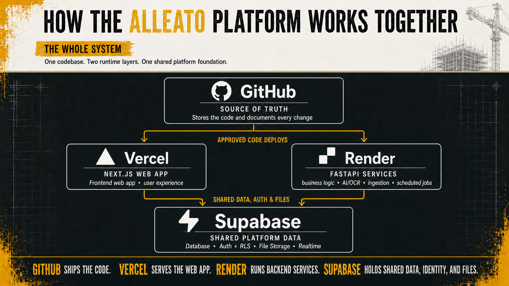

# Alleato Owner’s Guide

## How the Codebase Works

**Prepared for:** Brandon Clymer, CEO, Alleato Group

**Updated:** July 13, 2026

This guide explains where the Alleato application lives, what each platform controls, and how to use Claude Code to request and review changes. It is the detailed companion to the [visual HTML guide](./alleato-owner-developer-guide.html) and [print-ready PDF](./alleato-owner-developer-guide.pdf).

## Quick Links

| Resource | What it opens |
| --- | --- |
| [Production application](https://projects.alleatogroup.com) | The live Alleato application used in a browser |
| [GitHub repository](https://github.com/The-Alleato-Group/project-management) | The official application code and change history |
| [Vercel project](https://vercel.com/the-alleato-group/project-management-agent) | Frontend deployments, previews, and production status |
| [Render backend service](https://dashboard.render.com/web/srv-d8271ohj2pic739klb7g) | Backend service status, deployments, and logs |
| [Supabase project](https://supabase.com/dashboard/project/lgveqfnpkxvzbnnwuled) | Database, users, permissions, and file storage |

The platform account pages require the appropriate Alleato login and permissions. Access should be granted to individual people rather than by sharing passwords.

## The Whole System

Alleato is one product supported by four primary platforms:

1. **GitHub stores the official code.** It records every approved change and provides the history needed to understand or reverse a change.
2. **Vercel runs the frontend.** This is the user-facing application, including pages, forms, tables, navigation, and browser interactions.
3. **Render runs the backend.** This is the behind-the-scenes functionality, including integrations, scheduled work, document processing, OCR, and data syncing.
4. **Supabase stores shared data.** It provides the database, authentication, permissions, and uploaded-file storage used by the frontend and backend.

Approved GitHub code is deployed to Vercel and Render. Both services read from and write to Supabase as needed.

## GitHub: The Codebase Home

**Repository:** [The-Alleato-Group/project-management](https://github.com/The-Alleato-Group/project-management)

GitHub stores the application code, documents every change, supports pull-request review, and provides a reliable history of the product.

The repository contains several major areas:

| Area | Plain-English purpose |
| --- | --- |
| `frontend/` | The screens and interactions people use in their browser |
| `backend/` | Behind-the-scenes services and business functionality |
| `supabase/` | Database changes and supporting Supabase configuration |
| `docs/` | Project instructions, operating notes, architecture, and owner documentation |
| `render.yaml` | The documented configuration for Render services |
| `AGENTS.md` | Required project rules that Claude Code and developers must follow |

### How pull requests work

A pull request is a controlled review step before a change becomes part of the official product.

1. A change is built on a separate branch or worktree.
2. The changed files and test results are pushed to GitHub.
3. A pull request shows what was added, removed, or modified.
4. The change is reviewed and automated checks run.
5. After approval, the pull request is merged into the main codebase.
6. Vercel and Render deploy the approved version when their configuration calls for it.

The `main` branch should represent the approved product. A proposed change can be reviewed or discarded without disturbing the live application.

## Vercel: Frontend and User-Facing Application

**Project:** [project-management-agent](https://vercel.com/the-alleato-group/project-management-agent)

**Live application:** [projects.alleatogroup.com](https://projects.alleatogroup.com)

Vercel hosts the pages, forms, tables, navigation, preview deployments, and production website people use in their browser.

Vercel is useful for:

- Viewing the status of a frontend deployment.
- Opening a temporary preview of a proposed change.
- Confirming which GitHub commit is currently deployed.
- Reviewing frontend build logs when a deployment does not complete.

A successful GitHub change does not automatically prove the visible application works correctly. The important workflow should also be opened and tested in the deployed site.

## Render: Backend Functionality

**Service:** [alleato-backend](https://dashboard.render.com/web/srv-d8271ohj2pic739klb7g)

Render runs integrations, scheduled jobs, document processing, OCR, data syncing, and other work that continues behind the application.

Render is useful for:

- Confirming whether the backend service is running.
- Reviewing backend deployment status.
- Reading service logs when a background process fails.
- Confirming which GitHub version is deployed.

The repository’s canonical backend service is `alleato-backend`. Railway references are historical and should not be treated as the current backend host.

## Supabase: Database, Access, and Files

**Project:** [Alleato Supabase dashboard](https://supabase.com/dashboard/project/lgveqfnpkxvzbnnwuled)

Supabase stores project records, financial data, users, permissions, uploaded files, and data used by search and AI features.

Supabase is useful for:

- Viewing database tables and records.
- Managing authentication and user access.
- Reviewing file storage.
- Confirming that approved database changes were applied.

Database changes deserve extra care because they can affect many parts of the application at once. Before approving one, confirm that the change has a migration file, has been applied to the correct Supabase project, and has been tested against the affected workflow.

## Making a Change with Claude Code Desktop

Claude Code can inspect the repository, propose a plan, edit files, run checks, and prepare a GitHub change. The owner remains responsible for describing the desired business result and approving the final outcome.

### Start the project

1. Open **Claude Code Desktop** and select **Code**.
2. Select **New session**.
3. Choose where the project lives:
   - **Cloud:** select the GitHub repository `The-Alleato-Group/project-management`.
   - **Local:** select the local folder that contains the project code.
4. Confirm the repository or folder and the active branch shown above the prompt.

### Describe the outcome

Include:

- Who the change is for.
- What workflow should improve.
- What the person should be able to accomplish.
- What must not change.
- How success should be tested.

Example prompt:

> For a project manager, improve the RFI review workflow so they can understand the current status and take the next action quickly. First inspect the existing implementation and project rules. Show me your plan, test the real workflow, and report what changed, what passed, what remains, and any risks.

### Review before approving

Ask Claude Code to provide:

- A plain-English summary of the change.
- The exact files changed.
- Screenshots of visible changes.
- The tests or checks that passed.
- Anything that remains incomplete or unverified.
- Any database, permission, deployment, or security impact.
- The GitHub commit or pull-request link.

For visible features, confirm the actual workflow in the browser. For database or backend changes, confirm the relevant Supabase migration or Render deployment rather than relying only on a statement that the code was changed.

## Owner Approval Checklist

Before approving a meaningful change, confirm:

- [ ] The requested business result is clear.
- [ ] Claude Code or the developer inspected `AGENTS.md` and the existing implementation first.
- [ ] The change was made in the correct GitHub repository.
- [ ] The changed files and purpose are explained in plain language.
- [ ] Automated checks passed, or any failures are clearly explained.
- [ ] The actual user workflow was tested when the change is user-facing.
- [ ] Database changes were applied and verified in Supabase when applicable.
- [ ] Frontend or backend deployments were verified when applicable.
- [ ] No passwords, API keys, or other secrets were placed in GitHub, screenshots, or documentation.
- [ ] A commit or pull-request link provides a permanent record of the work.

## Access and Security Basics

- Give each person their own account for GitHub, Vercel, Render, and Supabase.
- Grant only the access needed for the work.
- Keep multi-factor authentication enabled.
- Never send passwords or API keys in email, chat, prompts, screenshots, or documentation.
- Remove access promptly when someone no longer works on the project.
- Keep at least one owner-level recovery account under Alleato’s control.

## Plain-English Glossary

| Term | Meaning |
| --- | --- |
| **Codebase** | All files and instructions that make up the application |
| **Frontend** | The screens and interactions people use in a browser |
| **Backend** | Behind-the-scenes services and business functionality |
| **Database** | The organized records the application stores and retrieves |
| **Repository** | The GitHub home for the codebase and its history |
| **Branch** | A separate working version used to build a change safely |
| **Pull request** | A review page for a proposed code change |
| **Commit** | A saved, named checkpoint in the code history |
| **Deployment** | Publishing an approved version so a service can run it |
| **Migration** | A tracked change to the database structure or stored data |

## Document Set

- [Owner’s Guide in HTML](./alleato-owner-developer-guide.html)
- [Owner’s Guide as a PDF](./alleato-owner-developer-guide.pdf)
- [Detailed Markdown companion](./alleato-owner-developer-guide.md)
